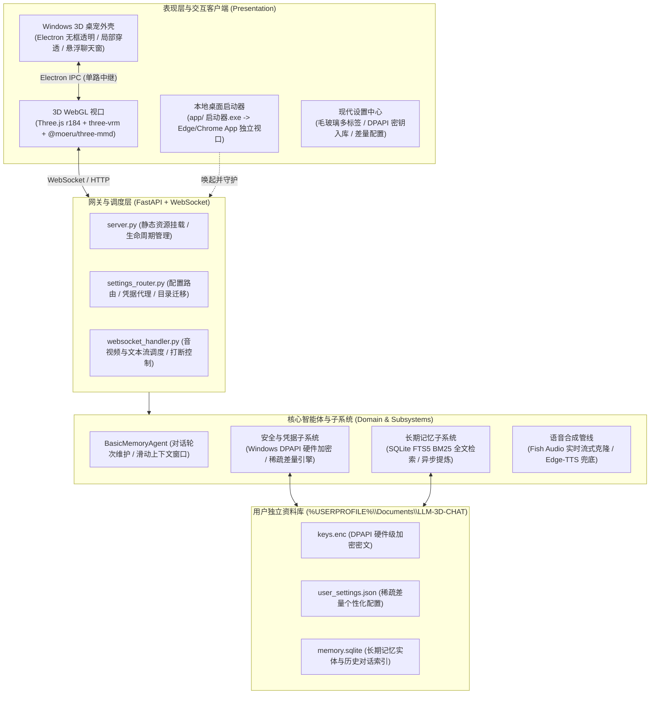

<div align="center">

# 3D-LLM / Open-LLM-VTuber
### 3D 数字人伴侣与桌面宠物系统 (3D Companion & Desktop Pet)

[ 简体中文 ](README.md) | [ English ](README_en.md)

</div>

---

面向 Windows 平台的 **3D 桌面数字人伴侣与桌宠系统**。本项目在原 Open-LLM-VTuber 基础上进行了全面重构，核心目标全面聚焦于 **3D 实时渲染交互** 与 **Windows 原生透明桌宠**。

系统原生支持 VRM 与 PMX (MMD) 双轨 3D 模型渲染，提供全身动作与表情口型联动、局部鼠标穿透的透明置顶桌宠外壳、独立悬浮聊天窗、基于 SQLite FTS5 的本地长期记忆，以及 Windows DPAPI 硬件级密钥安全保护。

---

## 目录
- [核心特性](#核心特性)
- [架构拓扑](#架构拓扑)
- [快速上手](#快速上手)
- [桌宠使用指南](#桌宠使用指南)
- [3D 资产与动作规范](#3d-资产与动作规范)
- [配置、凭据与数据隔离](#配置凭据与数据隔离)
- [工程目录结构](#工程目录结构)
- [排错与常见问题](#排错与常见问题)

---

## 核心特性

### 1. 3D 双轨实时渲染引擎
- **VRM & PMX (MMD) 原生双轨支持**：基于 Three.js (r184) + `@pixiv/three-vrm` 与 `@moeru/three-mmd`，支持在 `.vrm` (VRM 0.x / 1.0) 与日本标准 `.pmx` 模型间无缝切换。
- **视觉着色与光照调优**：移除导致卡通贴图漂白的 Tone Mapping，将场景光照总量精确压制在 ~2.4，自动剔除空法线贴图，还原 MToon 与二次元材质的层次感。
- **自动尺寸归一化**：以参考头骨高度自动计算缩放比例，不同原始尺度的模型载入后视口高度自动对齐。
- **视线追踪与自然生理节律**：头部与眼神跟随摄像机（`lookAt`）；基于正弦波算法的随机间隔自然眨眼。
- **Web Audio 频谱口型同步（Lip-sync）**：通过 Web Audio API `AnalyserNode` 实时提取语音 2~24 频段能量，毫秒级驱动模型 `aa` / `oh` 基础形态键混合，表现生动自然。

### 2. 专属肢体动作系统 (Motion System)
- **双轨解耦派发**：通过 `motionRouter` 自动识别模型类别，分别派发至专用动作驱动管线。
- **VRM 动捕与程序化兜底**：优先读取外部 `.vrma` 动捕文件；文件缺失时自动降级为 7 套世界系程序化骨骼动画（包含待机、轻微点头、摇头、欢呼跳跃、受惊、嘟嘴转身、害羞倾斜等），支持运行时骨骼朝向反解。
- **PMX 专属动作与姿态固化**：
  - 彻底消除传统 MMD 导入后的 40°~45° 僵硬 A-Pose，自动注入人体工学沉肩垂手（75°~80° 放松站姿）并固化至 `animationPose`。
  - 内置双下肢与足尖 CCDIK 逆运动学求解，确保下肢动作正常落地。
- **交互触碰反馈**：点击模型身体不同部位（按头身高度阈值判定）触发对应的情绪语音与肢体互动动作。

### 3. Windows 3D 悬浮桌宠外壳 (`desktop/`)
- **无框透明与全局置顶**：基于 Electron 定制，无边框、背景完全透明、窗口始终置顶且不抢占输入焦点（`focusable: false`），不占用 Alt+Tab 列表。
- **局部鼠标点击穿透**：通过视口内容判定，仅角色模型本体响应鼠标点击与拖拽，透明空白区域完全穿透至桌面底层窗口，不影响日常办公与游戏。
- **独立悬浮聊天窗**：极简毛玻璃气泡界面（320×140，可折叠至 320×58），通过 Electron 内部 IPC 单路中继角色视口的 WebSocket 连接。**绝不建立第二条连接**，彻底避免后端上下文分叉和语音流冲突。
- **系统托盘与全局热键**：
  - `Ctrl+Shift+Space`：呼出 / 隐藏独立聊天窗。
  - `Ctrl+Shift+R`：进入 / 退出自由拉伸调整尺寸模式。
  - `Ctrl+Shift+S`：呼出设置中心。
  - 托盘右键菜单支持一键切换角色、预设尺寸（小/中/大）、取景视角（胸像/半身/全身）、穿透开关与位置复位。
- **无黑框纯净启动**：`启动桌宠.lnk` 直接拉起 GUI 子系统进程，任务栏零多余控制台黑窗。

### 4. 本地轻量桌面启动器 (`app/`)
- **独立 App 视口**：`app/启动器.exe`（C# 轻量宿主）负责自动检测端口并拉起后端，随后以 Edge/Chrome 的 `--app` 模式加载 3D 独立窗口（无地址栏、无标签页）。
- **进程生命周期联动**：关闭独立视口窗口即自动终止后端进程并释放端口。
- **前端开发免编译热重载**：服务端直接挂载本地 `vrm_frontend/` 目录，修改 HTML/JS/CSS 或动作文件后，在窗口中直接按 `F5` 刷新即可生效。

### 5. 凭据安全与用户数据隔离
- **物理级数据解耦 (Stateless 仓库)**：代码仓库完全无状态。所有用户配置、对话记忆与加密凭据均保存在 Windows 原生文档目录（`%USERPROFILE%\Documents\LLM-3D-CHAT`），代码无论如何拉取、切分支或更新，绝不丢失个人数据。
- **Windows DPAPI 硬件级加密保险库**：调用 Windows 系统原生 `CryptProtectData` 加密 API 密钥，密钥与当前操作系统登录凭据绑定；配置文件中仅保存 `KEY_VAULT` 引用，杜绝密钥明文泄漏。
- **稀疏差量配置 (Sparse Overrides)**：系统仅在 `user_settings.json` 中保存用户改动过的非默认字段，默认配置随仓库自动演进，随时可单项恢复默认值。

### 6. 长期记忆与高效交互闭环
- **本地 SQLite FTS5 长期记忆**：内置 BM25 检索评分算法，在调用 LLM 前毫秒级召回与当前话题关联的历史记忆，施加严格的 Token 预算控制。
- **后台异步提炼**：对话轮次结束后由后台任务异步归纳记忆碎片，具备防重压机制，不阻塞实时对话流。
- **低延迟语音链路**：
  - 输入：前端原生 Web Speech API 零内存开销捕获语音，支持即时打断。
  - 决策：规范收敛至标准 OpenAI 兼容 `/v1` 协议（原生支持 DeepSeek、Qwen、Ollama、LM Studio 等）。
  - 合成：默认集成 Fish Audio 高品质流式语音克隆（长连接复用与低延迟模式），备有免费 Edge-TTS 降级方案。
- **网络代理自愈**：启动时自动检测 Windows 注册表代理设置，修正 `https://` 握手协议错误并探测连通性；失效代理自动绕过走直连，阻断外网 API 假死报错。

---

## 架构拓扑



---

## 快速上手

### 1. 环境要求
- **操作系统**：Windows 10 / Windows 11 (64-bit)
- **Python 环境**：Python 3.10 ~ 3.12（推荐使用 [uv](https://github.com/astral-sh/uv)）
- **Node.js**：仅在初次运行桌面宠物模式（`desktop/`）时需要安装依赖。

### 2. 依赖安装

#### 后端 Python 环境
推荐使用 `uv` 快速同步虚拟环境：
```powershell
uv sync
```
或使用传统 pip 安装：
```powershell
pip install -r requirements.txt
```

#### 桌宠 Electron 壳（如需运行桌宠）
```powershell
cd desktop
npm install
node node_modules\electron\install.js
cd ..
```

### 3. 运行项目

本项目提供三种运行模式，根据日常使用场景选择：

#### 模式 A：独立视口模式（日常推荐）
直接双击仓库根目录的 **`启动Open-LLM-VTuber.lnk`**，或在命令行运行：
```bat
app\launcher.bat
```
启动器将自动拉起后台服务，等待就绪后通过系统的 Edge 或 Chrome 以 `--app` 模式打开无地址栏的独立视口窗口。关闭窗口即自动退出后端服务。

#### 模式 B：桌面宠物模式（桌宠日常使用）
直接双击仓库根目录的 **`启动桌宠.lnk`**。
> 提示：该快捷方式直连 GUI 子系统，任务栏不会产生任何额外的命令行黑框窗口。桌宠将以透明通道直接出现在屏幕右下角。

#### 模式 C：纯后端服务调试模式
若需手动在浏览器中调试或修改前端代码：
```powershell
python run_server.py
```
启动后在浏览器中打开：`http://localhost:12393/vrm/`。

---

## 桌宠使用指南

### 全局快捷键与操作

| 快捷键 / 操作 | 触发功能 | 说明 |
| :--- | :--- | :--- |
| `Ctrl + Shift + Space` | **呼出 / 隐藏聊天窗** | 展开或收纳悬浮聊天对话框，支持回车发送文字 |
| `Ctrl + Shift + R` | **调整大小模式** | 出现辅助外边框，可按住边缘拉伸调整窗口尺寸与模型大小 |
| `Ctrl + Shift + S` | **打开设置中心** | 呼出独立浏览器配置页面，调整 LLM、TTS 与角色参数 |
| **鼠标左键按住身体** | **拖拽移动** | 拖动角色至屏幕任意位置放置 |
| **鼠标点击身体/头部** | **交互反馈** | 点击身体或面部，触发随机动作与语音反馈 |
| **空白透明区域** | **完全穿透** | 鼠标操作直接穿透至桌面底层应用，完全不挡日常工作 |

### 系统托盘菜单
在 Windows 任务栏右下角找到桌宠图标：
- **左键单击图标**：一键隐藏 / 显示桌面宠物。
- **右键单击图标**：
  - **角色切换**：单选切换当前加载的模型与人设。
  - **预设尺寸**：快速切换为「小 / 中 / 大」标准尺寸。
  - **取景模式**：切换「胸像 / 半身 / 全身」构图视角。
  - **点击穿透 / 始终置顶**：实时切换窗口穿透与置顶策略。
  - **回到右下角**：一键将角色重置回屏幕右下角安全停靠位。
  - **退出**：干净清理并退出 Electron 进程。

---

## 3D 资产与动作规范

### 1. 内置角色资产清单

| 角色名称 | 格式类别 | 配置文件路径 | 模型存放路径 | 核心特征 |
| :--- | :--- | :--- | :--- | :--- |
| **坎特蕾拉 (PMX)** | 日本标准 PMX | `characters/zh_cantarella_pmx_01.yaml` | `pmx-models/坎特蕾拉/` | 原生 MMD 资产，带双足 IK 链与专属动作驱动 |
| **托尔 (PMX)** | 日本标准 PMX | `characters/zh_tohru_01.yaml` | `pmx-models/托尔/` | 标准 MMD 骨架与 A-Pose，裙摆及发丝含次级骨 |
| **时崎狂三 (PMX)** | 日本标准 PMX | `characters/zh_tokisaki_kurumi_01.yaml` | `pmx-models/时崎狂三/` | 骨骼经标准化重构，修复面部权重并注入双足 IK |
| **喜多郁代 (VRM)** | VRM 0.x | `characters/zh_kita_ikuyo_01.yaml` | `vrm-models/喜多郁代/` | 经过材质与法线修复，高灵敏度表情联动 |
| **由比滨结衣 (VRM)**| VRM 1.0 | `characters/zh_yuigahama_yui_01.yaml` | `vrm-models/由比滨结衣/`| 原生 VRM 1.0 骨骼体系与动态视线追踪 |
| **雷电将军 (VRM)** | VRM 0.x | `characters/zh_raiden_shogun_01.yaml` | `vrm-models/雷电将军/` | 经尺寸归一化校验与优化 |

### 2. 导入自定义模型

#### VRM 模型导入
1. 将 `.vrm` 模型文件放入 `vrm-models/<你的角色名>/` 目录。
2. 在 `characters/` 目录下创建对应的 `zh_<你的角色名>.yaml`。
3. 在 yaml 中指定模型路径：`vrm_model: /vrm-models/<你的角色名>/<文件名>.vrm`，并配置对应的人设提示词与声音音色。

#### PMX (MMD) 模型导入准入要求
置入 `pmx-models/` 的资产必须 100% 符合日本标准 MMD 规范（详见 [`pmx-models/README.md`](pmx-models/README.md) 与 [`pmx_motion/README.md`](pmx_motion/README.md)）：
- **骨骼命名**：躯干（`全ての親`、`センター`、`下半身`、`上半身`、`上半身2`、`首`、`頭`）、四肢与下肢 IK（`左足ＩＫ`、`右足ＩＫ`、`左つま先ＩＫ`、`右つま先ＩＫ`）必须完备。
- **初始姿态**：模型休止姿态必须为标准的 **A-Pose**（双臂从水平下压约 40°），严禁导入 T-Pose。
- **形态键规范**：包含标准 MMD 眨眼与口型：`まばたき`、`あ`、`お`、`笑い`。

### 3. 模型高模减面工具
若 VRM 模型面数过高（数十万至百万面）导致渲染掉帧，可使用项目内置工具进行无损骨骼减面：
```powershell
python scripts/optimize_vrm.py <输入模型.vrm> -o <输出模型.vrm> -si 0.15 -se 0.005
```
> 工具基于 `gltfpack` 进行网格简化，并能自动推算骨骼索引偏移，把 VRM 扩展与弹簧骨无缝搬回，无需打开 Blender 即可完成轻量化。

---

## 配置、凭据与数据隔离

### 1. 用户数据仓 (`LLM-3D-CHAT`)
运行后，所有用户私有数据将统一存放于当前系统的文档目录下：
`%USERPROFILE%\Documents\LLM-3D-CHAT`

- `keys.enc`：调用 Windows DPAPI 硬件加密后的密钥文件，仅在当前用户登录时方可在内存中解密。
- `user_settings.json`：仅持久化保存用户在界面中改动过的配置（稀疏差量覆盖）。
- `memory.sqlite`：SQLite 数据库，包含 FTS5 全文索引，记录对话历史摘要与实体记忆。

### 2. 现代设置中心
使用快捷键 `Ctrl+Shift+S` 或在浏览器打开 `http://localhost:12393/vrm/settings.html`：
- **LLM 服务商选择**：预置官方 DeepSeek、OpenRouter、SiliconFlow、Ollama 等模板，填入 Base URL 与模型名称即可直接使用。
- **API 密钥入库**：在设置界面中输入的 API Key 将直接加密写入 `keys.enc`，无需手动在任何 YAML 文件中填写明文密钥。
- **TTS 音色控制**：切换 Fish Audio 在线音色或 Edge-TTS 本地发音人，微调语速、音温与长连接模式。
- **记忆与存储**：查看当前记忆条数，或一键将数据目录热迁移到其他磁盘分区。

---

## 工程目录结构

```text
Open-LLM-VTuber/
├── 启动Open-LLM-VTuber.lnk      # 独立视口桌面启动快捷方式
├── 启动桌宠.lnk                 # 无框透明桌宠快捷方式（GUI 直启）
├── run_server.py                # 后端服务主入口（含代理自愈与生命周期总控）
├── conf.yaml                    # 全局基础配置文件
│
├── app/                         # 桌面 App 视口启动器
│   ├── 启动器.exe               # C# 轻量宿主（无控制台黑窗）
│   ├── launcher.py              # 端口探测、后端拉起与 Edge/Chrome App 视口调度
│   └── README.md
│
├── desktop/                     # Windows 3D 桌宠外壳工程（Electron）
│   ├── main.js                  # 窗口透明化、穿透判定、托盘菜单、IPC 中继
│   ├── preload.js               # IPC 桥接安全上下文
│   ├── chat.html / chat.js      # 独立悬浮聊天气泡窗口
│   └── README.md
│
├── vrm_frontend/                # 3D 表现层（挂载于 /vrm 路由）
│   ├── index.html / app.js      # Three.js 场景渲染、VRM/PMX 载入、口型与表情驱动
│   ├── settings.html            # 现代设置中心
│   ├── libs/ & utils/           # 本地化运行时（Three.js r184、three-vrm、three-mmd）
│   ├── motions/                 # 外部 .vrma 动捕资产与待机动作
│   └── README.md
│
├── pmx_motion/                  # PMX 专属动作与姿态驱动系统
│   ├── index.js                 # A-Pose 休止姿态矫正、CCDIK 逆运动学求解、专属程序化动作
│   └── README.md
│
├── pmx-models/                  # PMX (MMD) 角色模型资产与准入规范
├── vrm-models/                  # VRM 角色模型资产
├── characters/                  # 角色提示词与人设覆写配置 (*.yaml)
│
├── src/open_llm_vtuber/         # 后端核心源码
│   ├── server.py                # FastAPI 静态资源挂载与路由
│   ├── settings_router.py       # 设置中心 API 路由与差量配置调度
│   ├── memory/                  # 长期记忆子系统 (SQLite FTS5 + BM25 检索)
│   ├── security/                # DPAPI 硬件加密保险库与存储路径管理
│   ├── tts/                     # Fish Audio / Edge-TTS 语音合成适配
│   └── agent/                   # 对话智能体与 LLM 统一适配工厂
│
├── scripts/                     # 工程工具集（如 optimize_vrm.py 模型减面）
└── doc/                         # 系统架构评测报告与技术设计文档
```

---

## 排错与常见问题

### 1. 启动器提示端口已被占用 / 改动后端代码不生效
- **原因**：`12393` 端口已有后台进程在运行。启动器会直接复用已存在端口的进程，因此新修改的 Python 代码未被载入。
- **解决方式**：在 PowerShell 中执行以下命令查杀残留进程：
  ```powershell
  # 查找占用 12393 端口的进程 PID
  Get-NetTCPConnection -LocalPort 12393 -State Listen | Select-Object OwningProcess
  # 强制结束该进程
  Stop-Process -Id <查到的PID> -Force
  ```

### 2. 外网大模型或 TTS 请求握手失败 (SSL EOF)
- **原因**：某些代理工具（如 Clash / Mihomo）退出后，Windows 注册表残留代理配置，且将 scheme 误设为 `https://`，导致 Python 连接代理握手崩溃。
- **解决方式**：本项目在 `run_server.py` 启动阶段内置了代理自愈逻辑，会自动将 scheme 修正为 `http://` 隧道并校验可达性；若代理不可达会自动降级为 `NO_PROXY` 直连。你也可以手动在 Windows「设置 - 网络和 Internet - 代理」中检查代理开关。

### 3. 移动项目目录后快捷方式失灵
- **原因**：Windows 快捷方式（`.lnk`）记录的是创建时的绝对路径。
- **解决方式**：在 PowerShell 中执行以下命令重建桌宠快捷方式（将 `$root` 改为你当前的实际路径）：
  ```powershell
  $root = (Get-Location).Path
  $ws = New-Object -ComObject WScript.Shell
  $sc = $ws.CreateShortcut("$root\启动桌宠.lnk")
  $sc.TargetPath       = "$root\desktop\node_modules\electron\dist\electron.exe"
  $sc.Arguments        = "."
  $sc.WorkingDirectory = "$root\desktop"
  $sc.IconLocation     = "$root\frontend\favicon.ico,0"
  $sc.Save()
  ```

---

## 协议与致谢

- 本项目基于开源项目 [Open-LLM-VTuber](https://github.com/Open-LLM-VTuber/Open-LLM-VTuber) 重构演进。
- 3D 渲染与模型运行时依赖于 [Three.js](https://threejs.org/)、[@pixiv/three-vrm](https://github.com/pixiv/three-vrm) 与 [@moeru/three-mmd](https://github.com/moeru-ai/three-mmd)。
- 角色模型资产来源于公开二次元社区，版权归属原模型创作者所有，仅供个人非商用学习与交流使用。
