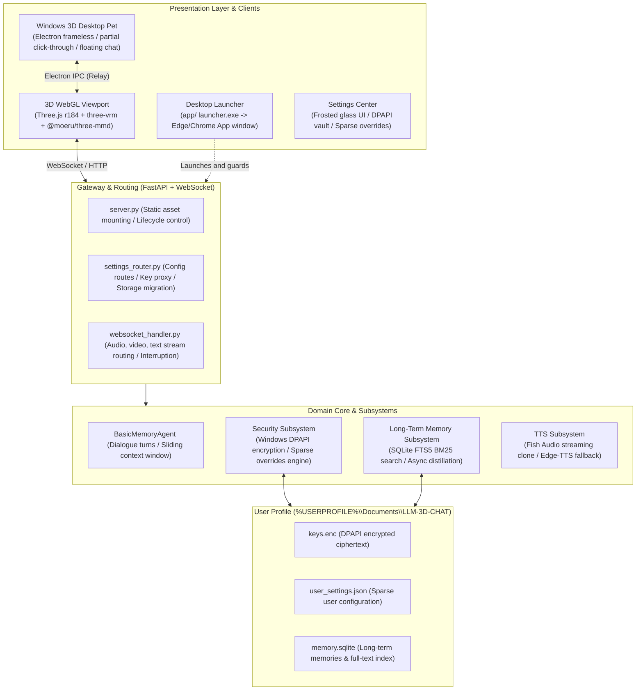

<div align="center">

# 3D-LLM / Open-LLM-VTuber
### 3D AI Companion & Desktop Pet System

[ 简体中文 ](README.md) | [ English ](README_en.md)

</div>

---

A native Windows **3D AI companion and desktop pet system**. Forked and heavily re-engineered from Open-LLM-VTuber, this project shifts its core focus entirely to **real-time 3D rendering interactions** and a **native frameless transparent Windows desktop pet experience**.

The system natively supports dual-track rendering for both VRM and PMX (MMD) models, synchronized full-body motions and audio-driven lip-sync, a transparent always-on-top desktop pet shell with partial click-through, a standalone floating chat window, local long-term memory powered by SQLite FTS5, and hardware-backed API credential encryption via Windows DPAPI.

---

## Table of Contents
- [Key Features](#key-features)
- [Architecture Topology](#architecture-topology)
- [Quick Start](#quick-start)
- [Desktop Pet Guide](#desktop-pet-guide)
- [3D Assets & Motion Standards](#3d-assets--motion-standards)
- [Configuration, Vault & Data Isolation](#configuration-vault--data-isolation)
- [Repository Structure](#repository-structure)
- [Troubleshooting](#troubleshooting)

---

## Key Features

### 1. Dual-Track 3D Real-Time Rendering Engine
- **Native VRM & PMX (MMD) Support**: Built on Three.js (r184), `@pixiv/three-vrm`, and `@moeru/three-mmd`. Allows seamless runtime switching between `.vrm` (VRM 0.x / 1.0) and standard Japanese `.pmx` models.
- **Lighting & Shading Tuned for Anime Models**: Tone mapping (ACESFilmic) is completely bypassed to prevent overexposure of pale textures. Total scene illumination is capped at ~2.4, and placeholder normal maps are automatically pruned to preserve MToon and toon-shaded details.
- **Automatic Scale Normalization**: Dynamically deduces scale factors against a normalized reference head-bone height, ensuring models with different authoring scales align at a consistent visual height.
- **Gaze Tracking & Natural Physiology**: Head and eye gaze naturally follow the camera (`lookAt`); realistic eyelid blinks are generated using randomized sine-curve intervals.
- **Web Audio Spectral Lip-Sync**: Real-time frequency analysis (bins 2–24) via Web Audio API `AnalyserNode` drives `aa` and `oh` morph target weights in milliseconds.

### 2. Dedicated Motion & Stance System
- **Dual-Track Dispatching**: The `motionRouter` detects model formats at runtime and dispatches commands to the proper animation pipeline.
- **VRM MoCap with Procedural Fallbacks**: Prioritizes external `.vrma` motion-capture files. If a file is absent, the engine falls back to 7 procedural world-space bone clips (idle, nod, shake head, cheerful bounce, surprise jump, pout turn, shy tilt) with runtime aim solving.
- **PMX Dedicated Stance & Physics**:
  - Eliminates the stiff default 40°–45° A-Pose in MMD models by applying an ergonomic relaxed standing stance (75°–80° lowered arms with slight elbow bends) and locking it directly into `animationPose`.
  - Integrates lower-body and toe CCDIK solvers to prevent feet sliding and leg stiffness during VMD playback.
- **Hit-Test Feedback**: Mouse clicks on different parts of the character (differentiated by head and torso height thresholds) trigger corresponding emotional animations and voice responses.

### 3. Windows 3D Desktop Pet Shell (`desktop/`)
- **Frameless, Transparent, and Always-on-Top**: Built with Electron. Fully transparent background, zero border, pinned on top, and does not steal focus (`focusable: false`), keeping the Alt+Tab switcher clean.
- **Partial Mouse Click-Through**: Only the visible geometry of the 3D character accepts clicks and dragging. Transparent background areas pass all mouse events directly to underlying applications without disrupting your workflow.
- **Standalone Floating Chat Window**: Frosted-glass minimal chat bubble (320×140, collapsible to 320×58). Communicates via Electron IPC to relay messages through the avatar viewport's single WebSocket connection. **Never opens a secondary WebSocket**, preventing session forks and TTS stream conflicts.
- **System Tray & Global Hotkeys**:
  - `Ctrl + Shift + Space`: Toggle the floating chat window.
  - `Ctrl + Shift + R`: Enter / exit window resize & drag-to-scale mode.
  - `Ctrl + Shift + S`: Open the settings dashboard.
  - Right-click tray menu provides character switching, preset sizes (small / medium / large), framing modes (bust / waist / full body), click-through toggle, and corner docking.
- **Clean Console-Free Launch**: `启动桌宠.lnk` points straight to the Electron GUI executable, leaving zero dangling command-prompt windows on your taskbar.

### 4. Lightweight Local Desktop Launcher (`app/`)
- **Dedicated App Viewport**: `app/启动器.exe` (compiled C# wrapper) checks port availability, boots the Python backend, and launches an Edge/Chrome `--app` window without navigation bars or tabs.
- **Coordinated Lifecycle**: Closing the viewport window automatically terminates the Python backend process and frees the port.
- **Zero-Build Hot Reload for Frontend**: The server directly serves the `vrm_frontend/` directory. Edits to HTML, JavaScript, CSS, or `.vrma` files take effect immediately by pressing `F5` in the window.

### 5. Credential Security & Data Isolation
- **Stateless Repository Design**: The code repository is strictly stateless. All user configs, chat logs, and encrypted secrets are stored under the native Windows user directory (`%USERPROFILE%\Documents\LLM-3D-CHAT`). Pulling commits or switching branches will never wipe your personal data.
- **Hardware-Level Windows DPAPI Vault**: API keys are encrypted via Windows `CryptProtectData`. The ciphertext is bound to your Windows user account. Config files store only a `KEY_VAULT` reference rather than plaintext secrets.
- **Sparse Overrides**: The system saves only non-default changes to `user_settings.json`. Base settings upgrade cleanly with upstream changes, and any setting can be reverted individually to default.

### 6. Long-Term Memory & Low-Latency Dialogue Pipeline
- **Local SQLite FTS5 Long-Term Memory**: Uses the BM25 retrieval ranking algorithm to fetch relevant conversation memories before dispatching user input to the LLM, governed by strict token budgets.
- **Asynchronous Distillation**: Post-turn summarization runs in a background task with rate-limiting and duplicate prevention, keeping conversational turns responsive.
- **Streamlined Voice Loop**:
  - Input: Native browser Web Speech API captures speech with zero background memory overhead and supports instant interruption.
  - Model: Unified under standard OpenAI-compatible `/v1` endpoints (works with DeepSeek, Qwen, Ollama, LM Studio, Claude, etc.).
  - Output: Integrated with Fish Audio real-time streaming voice cloning (supporting persistent connection reuse) and Microsoft Edge-TTS as a zero-cost local fallback.
- **Network Proxy Self-Healing**: Automatically scans Windows registry proxy settings at startup, resolves malformed `https://` proxy schemes, verifies connectivity, and sets `NO_PROXY` bypass for dead proxies to prevent SSL EOF handshake failures.

---

## Architecture Topology



---

## Quick Start

### 1. Requirements
- **Operating System**: Windows 10 / Windows 11 (64-bit)
- **Python Runtime**: Python 3.10 to 3.12 (managed with [uv](https://github.com/astral-sh/uv) recommended)
- **Node.js**: Required only during initial setup of the desktop pet shell (`desktop/`).

### 2. Dependency Installation

#### Backend Python Environment
Using `uv` for fast virtualenv synchronization:
```powershell
uv sync
```
Or with standard pip:
```powershell
pip install -r requirements.txt
```

#### Desktop Pet Shell (Optional, for Pet Mode)
```powershell
cd desktop
npm install
node node_modules\electron\install.js
cd ..
```

### 3. Launching the System

Choose one of three modes depending on your workflow:

#### Mode A: Standalone Viewport Mode (Daily Work)
Double-click **`启动Open-LLM-VTuber.lnk`** in the repository root, or run:
```bat
app\launcher.bat
```
The launcher will start the backend, wait for it to become ready, and open a dedicated Edge/Chrome `--app` window without browser bars. Closing this window terminates the backend process and releases the port.

#### Mode B: Desktop Pet Mode (Transparent Companion)
Double-click **`启动桌宠.lnk`** in the repository root.
> Note: This shortcut runs the GUI subsystem binary directly, so no extra command-prompt window appears on your taskbar. The character will stand directly on your desktop.

#### Mode C: Backend Service Debugging Mode
To inspect logs in the console or debug frontend code in your own browser:
```powershell
python run_server.py
```
Then navigate to `http://localhost:12393/vrm/` in any modern browser.

---

## Desktop Pet Guide

### Global Hotkeys & Mouse Actions

| Shortcut / Action | Function | Details |
| :--- | :--- | :--- |
| `Ctrl + Shift + Space` | **Toggle Chat Window** | Expand or collapse the floating chat box; press Enter to send messages |
| `Ctrl + Shift + R` | **Resize Mode** | Displays border handles; drag window edges to rescale the model and window |
| `Ctrl + Shift + S` | **Open Settings** | Opens the configuration page in your browser |
| **Left Click & Drag Model** | **Move Window** | Drag the character across your screens |
| **Click on Head / Torso** | **Interactive Reactions** | Triggers randomized animations and voice responses |
| **Transparent Background** | **Click-Through** | Mouse clicks pass cleanly through to whatever application is underneath |

### System Tray Controls
Locate the pet icon in the Windows notification area (bottom-right corner):
- **Left-click**: Instantly hide or reveal the character.
- **Right-click menu**:
  - **Character Selector**: Switch between loaded models and personas.
  - **Preset Sizes**: Snap to Small, Medium, or Large.
  - **Framing**: Switch camera views between Bust, Half Body, and Full Body.
  - **Click-Through / Always-on-Top**: Toggle window transparency and stacking behavior.
  - **Reset to Bottom-Right**: Dock the pet back to its default bottom-right screen position.
  - **Exit**: Cleanly shut down the Electron process.

---

## 3D Assets & Motion Standards

### 1. Built-in Characters

| Character Name | Format | Config File | Model Directory | Key Highlights |
| :--- | :--- | :--- | :--- | :--- |
| **Cantarella (PMX)** | Japanese PMX | `characters/zh_cantarella_pmx_01.yaml` | `pmx-models/坎特蕾拉/` | Native MMD asset with leg IK chains and custom motion system |
| **Tohru (PMX)** | Japanese PMX | `characters/zh_tohru_01.yaml` | `pmx-models/托尔/` | Standard MMD rig with A-Pose, skirt and hair secondary bones |
| **Kurumi Tokisaki (PMX)** | Japanese PMX | `characters/zh_tokisaki_kurumi_01.yaml` | `pmx-models/时崎狂三/` | Standardized MMD bone hierarchy with repaired facial skinning & leg IK |
| **Kita Ikuyo (VRM)** | VRM 0.x | `characters/zh_kita_ikuyo_01.yaml` | `vrm-models/喜多郁代/` | Tuned lighting, purged invalid normal maps, expressive facial blendshapes |
| **Yuigahama Yui (VRM)**| VRM 1.0 | `characters/zh_yuigahama_yui_01.yaml` | `vrm-models/由比滨结衣/`| Native VRM 1.0 humanoid skeleton with gaze tracking |
| **Raiden Shogun (VRM)** | VRM 0.x | `characters/zh_raiden_shogun_01.yaml` | `vrm-models/雷电将军/` | Scale-normalized and optimized geometry |

### 2. Importing Custom Models

#### Adding VRM Models
1. Place your `.vrm` file inside `vrm-models/<character_name>/`.
2. Create a configuration file `zh_<character_name>.yaml` under `characters/`.
3. Set the model path in yaml: `vrm_model: /vrm-models/<character_name>/<filename>.vrm`, and configure persona prompts and voice settings.

#### Adding PMX (MMD) Models
Assets placed in `pmx-models/` must strictly adhere to Japanese standard MMD conventions (see [`pmx-models/README.md`](pmx-models/README.md) and [`pmx_motion/README.md`](pmx_motion/README.md)):
- **Bone Hierarchy**: Essential bones (`全ての親`, `センター`, `下半身`, `上半身`, `上半身2`, `首`, `頭`), limbs, and foot IK chains (`左足ＩＫ`, `右足ＩＫ`, `左つま先ＩＫ`, `右つま先ＩＫ`) must be present.
- **Rest Pose**: Must be saved in a standard **A-Pose** (arms lowered ~40° from horizontal). Never import models in a T-Pose.
- **Morph Targets**: Must include standard morph names for blinks and vowels: `まばたき`, `あ`, `お`, `笑い`.

### 3. Mesh Decimation Tool for High-Poly Models
If a VRM model has excessive polygons (hundreds of thousands or millions) leading to rendering stutters, optimize it with the built-in decimation script:
```powershell
python scripts/optimize_vrm.py <input.vrm> -o <output.vrm> -si 0.15 -se 0.005
```
> This script uses `gltfpack` to simplify geometry while recalculating bone index offsets, seamlessly transplanting VRM extensions and spring bones back into the optimized model without requiring Blender.

---

## Configuration, Vault & Data Isolation

### 1. User Profile Directory (`LLM-3D-CHAT`)
All user data is stored outside the code repository at:
`%USERPROFILE%\Documents\LLM-3D-CHAT`

- `keys.enc`: Encrypted using Windows DPAPI, readable only when logged in under your Windows user account.
- `user_settings.json`: Persists only settings that differ from repository defaults (sparse delta).
- `memory.sqlite`: SQLite database with FTS5 full-text indexing containing conversational history and semantic memories.

### 2. Modern Settings Center
Press `Ctrl + Shift + S` or browse to `http://localhost:12393/vrm/settings.html`:
- **LLM Provider Presets**: Instant configuration templates for DeepSeek, OpenRouter, SiliconFlow, Ollama, and custom OpenAI-compatible endpoints.
- **API Key Vault**: Keys entered in the UI are saved encrypted to `keys.enc` automatically. No need to put plaintext tokens in YAML files.
- **TTS Controls**: Switch between Fish Audio voice clones and Edge-TTS local neural voices; adjust speed, temperature, and persistent connection modes.
- **Storage & Migration**: Inspect memory item counts or perform hot migration of the data directory to another drive.

---

## Repository Structure

```text
Open-LLM-VTuber/
├── 启动Open-LLM-VTuber.lnk      # App viewport launcher shortcut
├── 启动桌宠.lnk                 # Transparent desktop pet shortcut (clean GUI launch)
├── run_server.py                # Main backend entrypoint (proxy self-healing & lifecycle)
├── conf.yaml                    # Base configuration defaults
│
├── app/                         # Desktop App wrapper
│   ├── 启动器.exe               # Compiled C# launcher (no console window)
│   ├── launcher.py              # Port probe, backend spawn, Edge/Chrome App launcher
│   └── README.md
│
├── desktop/                     # Windows 3D desktop pet project (Electron)
│   ├── main.js                  # Window transparency, click-through, tray, IPC relay
│   ├── preload.js               # Secure IPC bridge
│   ├── chat.html / chat.js      # Floating chat bubble window
│   └── README.md
│
├── vrm_frontend/                # 3D presentation layer (mounted at /vrm)
│   ├── index.html / app.js      # Three.js scene, VRM/PMX loading, lip-sync & expressions
│   ├── settings.html            # Settings dashboard
│   ├── libs/ & utils/           # Local vendored runtimes (Three.js r184, three-vrm, three-mmd)
│   ├── motions/                 # External .vrma motion capture assets
│   └── README.md
│
├── pmx_motion/                  # PMX dedicated motion & stance system
│   ├── index.js                 # A-Pose correction, CCDIK solver, procedural clips
│   └── README.md
│
├── pmx-models/                  # PMX (MMD) models & admission standards
├── vrm-models/                  # VRM model assets
├── characters/                  # Character persona overrides (*.yaml)
│
├── src/open_llm_vtuber/         # Backend Python source code
│   ├── server.py                # FastAPI static mounting & lifespan
│   ├── settings_router.py       # Settings API routes & sparse delta engine
│   ├── memory/                  # Long-term memory subsystem (SQLite FTS5 + BM25)
│   ├── security/                # Windows DPAPI vault & dynamic path resolution
│   ├── tts/                     # Fish Audio & Edge-TTS voice adapters
│   └── agent/                   # Conversational agent & LLM factories
│
├── scripts/                     # Utility scripts (e.g. optimize_vrm.py mesh decimation)
└── doc/                         # System architecture evaluations & engineering records
```

---

## Troubleshooting

### 1. Port 12393 Already in Use / Backend Code Changes Do Not Take Effect
- **Cause**: An existing backend process is already listening on port `12393`. The launcher automatically connects to the existing instance instead of rebooting it.
- **Solution**: In PowerShell, terminate the lingering process:
  ```powershell
  # Find the PID holding port 12393
  Get-NetTCPConnection -LocalPort 12393 -State Listen | Select-Object OwningProcess
  # Terminate the process
  Stop-Process -Id <PID> -Force
  ```

### 2. External LLM or TTS Handshake Failures (SSL EOF)
- **Cause**: Some proxy applications leave Windows registry proxy entries behind upon exiting and mislabel the proxy scheme as `https://`, causing Python's httpx/requests to fail the TLS handshake.
- **Solution**: `run_server.py` includes built-in proxy self-healing on boot. It forces the proxy scheme to `http://` (tunnel) and validates socket reachability; unreachable proxies are bypassed with `NO_PROXY`. You can also check your proxy settings manually in Windows Settings -> Network & Internet -> Proxy.

### 3. Shortcuts Break After Moving the Project Directory
- **Cause**: Windows `.lnk` shortcuts contain absolute paths created at generation time.
- **Solution**: Recreate the desktop pet shortcut with PowerShell (adjusting `$root` to your actual path):
  ```powershell
  $root = (Get-Location).Path
  $ws = New-Object -ComObject WScript.Shell
  $sc = $ws.CreateShortcut("$root\启动桌宠.lnk")
  $sc.TargetPath       = "$root\desktop\node_modules\electron\dist\electron.exe"
  $sc.Arguments        = "."
  $sc.WorkingDirectory = "$root\desktop"
  $sc.IconLocation     = "$root\frontend\favicon.ico,0"
  $sc.Save()
  ```

---

## License & Acknowledgments

- Re-engineered from the open-source project [Open-LLM-VTuber](https://github.com/Open-LLM-VTuber/Open-LLM-VTuber).
- 3D graphics runtimes powered by [Three.js](https://threejs.org/), [@pixiv/three-vrm](https://github.com/pixiv/three-vrm), and [@moeru/three-mmd](https://github.com/moeru-ai/three-mmd).
- 3D character models are sourced from community creators for personal, non-commercial evaluation and study. Copyright belongs to their respective original creators.
