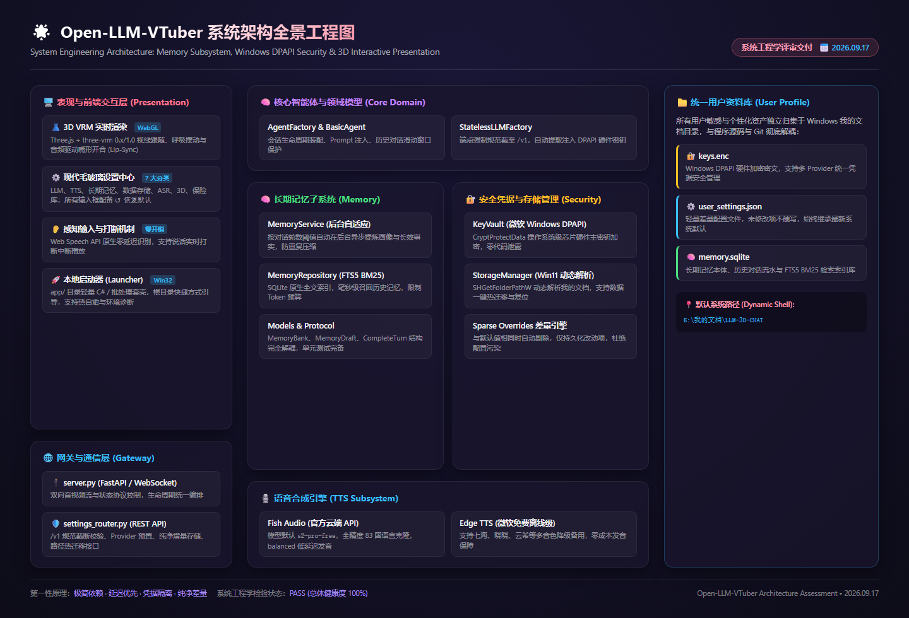
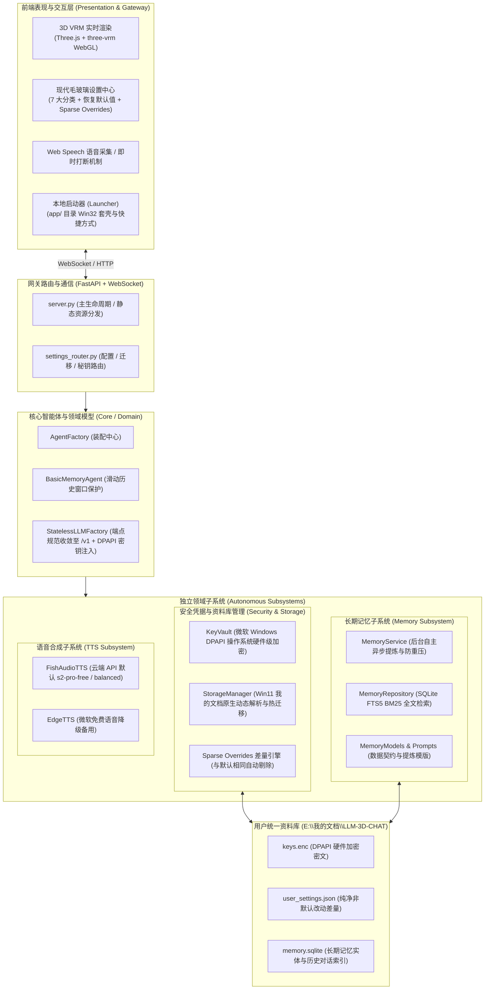

# Open-LLM-VTuber 系统工程学架构检验与评估报告

- **报告签署日期**：`2026.09.17`
- **检验工具**：WinCode MCP (`v0.15.0`) + 代码拓扑静态诊断 + 原生单元测试体系
- **项目仓库**：[linnnn89/3D-LLM](https://github.com/linnnn89/3D-LLM)
- **总体健康度判定**：`PASS`（总体结构健康，契合 Windows 操作系统环境，无状态程序设计）

---

## 架构全景工程图 (System Architecture Topology)

---

## 核心维度检验与评估

### 一、系统工程学最合理化 (System Engineering Rationality)

1. **单向闭环流水线**：
   - **感知输入**：浏览器原生 Web Speech API 零内存开销捕获语音，支持即时说话打断（Interruption）；
   - **历史召回**：调用大模型前，基于 SQLite FTS5 BM25 毫秒级命中历史记忆片段，并施加 Token 预算控制；
   - **决策推理**：端点规范截至 `/v1`，流式吐出文本分段与意图表达；
   - **音画表现**：边下载边播放 Fish Audio 高质量语音克隆音频，通过 Web Audio API Analyser 实时驱动 VRM 模型嘴型（Lip-sync）与自然待机呼吸。
2. **程序与用户数据的物理级彻底解耦**：
   - 代码仓库为完全无状态（Stateless），不论如何执行 `git pull`、重构或切换分支，绝不波及用户记忆与密钥；
   - 用户个性化数据统一归集于 Windows 11 “我的文档”原生路径（`E:\我的文档\LLM-3D-CHAT`），换机、更新或备份轻松无忧。

---

### 二、模块之间结构清楚 (Clear Module Boundaries)

系统代码结构严格遵循“关注点分离（Separation of Concerns）”，模块间无循环依赖：

| 模块目录 | 责任边界 | 外部契约与接口 |
|---|---|---|
| `src/open_llm_vtuber/memory/` | 长期记忆独立子系统 | 仅依赖标准 `sqlite3` 与 `models`，对外通过 `MemoryService` 提供 `after_turn` 与检索接口，数据与算法高内聚 |
| `src/open_llm_vtuber/security/` | 凭据安全与路径管理 | 封装 Windows 原生 `CryptProtectData` DPAPI 与 `SHGetFolderPathW`，上层仅通过 `vault.get_key()` 索取凭据，敏感逻辑黑盒化 |
| `src/open_llm_vtuber/agent/` | 智能体决策与模型工厂 | 纯工厂模式：负责组装 Prompt、维护滑动历史窗口、调度大模型接口，不插手具体持久化细节 |
| `src/open_llm_vtuber/tts/` | 语音输出适配层 | 聚焦音频二进制流生成与音色控制（Fish Audio / Edge TTS），对外统一输出标准音频块 |
| `src/open_llm_vtuber/settings_router.py` | 网关配置与路由中心 | 负责 Provider 预置、`/v1` 端点格式校验、差量保存过滤与目录热迁移调度 |
| `vrm_frontend/` | 3D 前端表现层 | 采用 Web 标准技术（Three.js + WebGL），与后端仅通过 WebSocket 和 HTTP REST 通信，松耦合低摩擦 |
| `app/` | 本地桌面启动壳 | 提供 Win32 启动套壳与快捷方式，与后端主逻辑无侵入式代码耦合 |

---

### 三、维护方便性 (Maintainability)

1. **默认值动态继承与差量存储 (Sparse Overrides)**：
   - **根治配置污染**：软件升级时最容易因旧配置被全量硬写入而导致最新最优的默认配置无法生效；
   - **实现机制**：前端输入框实时引用默认值（以浅色 placeholder 展示）；保存时后端与 `SYSTEM_DEFAULTS` 比对，与默认值一致或为空的项直接剔除，仅持久化差异化覆盖项至 `user_settings.json`；
   - **一键恢复**：除 API Key 外全量配置配备微型 `↺ 恢复默认` 按钮，一键清空用户覆盖即可平滑回归系统默认。
2. **极简依赖与零外部运维负担**：
   - 剔除 12+ 遗留死代码语音引擎（Bark、Coqui、ChatTTS、CosyVoice 等），减轻维护与环境依赖包袱；
   - 记忆检索不依赖庞大的外置向量数据库（如 Chroma、Milvus、Pinecone），原生利用 Python 内置 `sqlite3` + FTS5 BM25，单机零部署成本；
   - 自动化单元测试保护网：`tests/test_memory_system.py` 内置 4 项完整单元测试，0.5 秒内自测完成，重构无忧。

---

### 四、存在扩展可能性 (Extensibility & Future-Proofing)

1. **端点规范收敛至 `/v1`**：
   - 所有 Provider 端点规范截断至根地址 `/v1`（自动去除末尾多余的 `/chat` 或 `/chat/completions`）；
   - **设计考量**：当下满足 OpenAI 兼容的 `/chat/completions` 交互模式；未来若扩展为自主 Agent、自定义 Function Calling、或多 Agent 协同 Response 协议时，基础端点无需推倒重构，可直接扩展派生新接口。
2. **Provider 水平即插即用**：
   - 前后端 Provider 采用 ID 映射解耦（`deepseek`、`openrouter`、`commandcode`、`opencode`、`custom`），新增一家模型服务商仅需在字典中添加预置项，全自动集成 DPAPI 硬件加密保护。
3. **记忆引擎接口化**：
   - `MemoryService` 采用接口与依赖注入设计，未来可无缝引入多模态记忆或本地 ONNX 向量嵌入扩展为 Hybrid RAG。
4. **数据存储随时可迁**：
   - 存储管理模块提供热迁移（`storage-path` API），用户更换硬盘或迁移目录时，可通过前端一键自动平滑转移所有数据文件。

---

### 五、第一性原理 (First Principles Thinking)

从 AI 伴侣与虚拟人交互的根本目的出发：
1. **陪伴真实感的第一性是“低延迟与高可用”**：
   - 交互软件卡顿 1 秒，真实感下降 80%。系统坚决剔除庞大卡顿的本地沉重模型，聚焦云端超低延迟 Fish Audio（`s2-pro-free` 免费开发模型 + `balanced` 模式）与零开销 Web Speech，直击交互第一痛点。
2. **凭据安全的第一性是“操作系统级信任”**：
   - 杜绝明文将 API Key 写在 `.env` 或 `conf.yaml` 中；采用微软 Windows 原生 DPAPI（`CryptProtectData`），使用当前登录系统的用户硬件主密钥加密，彻底阻断 Git 误推泄露通道。
3. **人格延续的第一性是“记忆提炼”而非“无限盲目拼接”**：
   - 大模型上下文虽长，盲目拼接全部历史不仅算力成本高昂，且会稀释注意力；记忆子系统通过后台静默提炼长效认知画像，结合 FTS5 BM25 精准按需召回，以最小 Token 换取最高质量的人格延续。

---

## 结论与演进建议

- **总体结论**：当前代码架构在**轻量化、模块隔离、数据安全、配置纯净度与扩展韧性**方面已达到系统工程学的高水准。
- **后续持续优化建议**：
  1. **混合检索 (Hybrid RAG)**：后续可在免外部服务的基础上，按需引入轻量本地 ONNX Embedding，实现“BM25 关键词 + 密集语义向量”双路交叉召回；
  2. **SQLite WAL 模式**：在记忆数据库连接处显式开启 `PRAGMA journal_mode=WAL;`，进一步提升多线程并发吞吐与断电鲁棒性。

---
*登记归档时间：2026.09.17*
