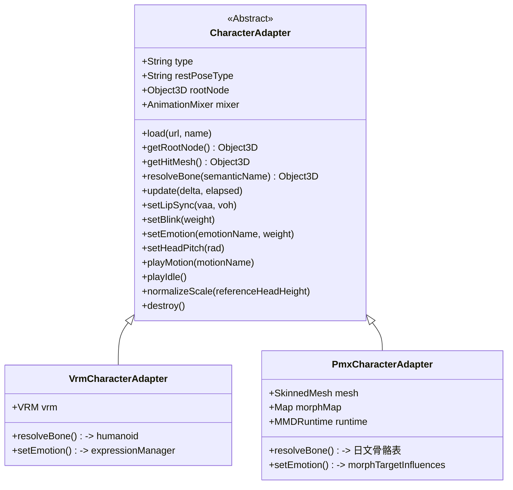

# VRM 与 PMX (MMD) 双轨原生渲染架构改造计划书

> 编制时间：2026-09-18
> **v1** 初版（含若干与仓库代码不符的论断）。
> **v2** 依据**当前仓库实际代码**与 **three r169 官方发布源码**复核：修正 v1 的 vendored 依赖清单错误（照做会 404）、补充 v1 完全遗漏的服务端静态路由与桌宠外壳耦合约束、新增「失能项与逐项补救」矩阵、把结论从「风险低」改为分级结论并划定 MVP 边界。
> **v3** 依据**外部公开项目与社区的实测记录**复核：**推翻 v2 §3.3 的「动作层可只维护一份」主张**（证据见 §3.3）、把足 IK 从第二期提前到与 VMD 同期、修正 v2「不上 Ammo 则头发裙摆僵住」的假两难、新增 §2.3 运行时选型对比（含同构参照项目 Project AIRI）。
> **v4** 补入**本机实测结果**（附录 C）：three r184 与现有 vendored three-vrm 完全兼容（骨骼数值与像素统计逐项相同）；`@moeru/three-mmd` 的 ESM dist 确认可在无打包器、纯 importmap 环境下直接加载。
> **升级已执行**：`vrm_frontend/libs`、`vrm_frontend/utils` 已落到 three r184，并通过「同一份真实 `app.js` 的升级前后对照」验证（附录 C.8）。§2.3、阶段一、附录 B 的对应条目由【未验证】升级为已实测。
> 目标工程：`vrm_frontend/`（前端渲染）+ `src/open_llm_vtuber/server.py`（静态资源路由）
> 核心目标：在保持现有业务逻辑（LLM 对话、音频驱动、表情联动、动作交互）**行为等价**的前提下，使前端具备原生支持 VRM 模型与 MMD (.pmx) 模型的无缝切换与统一驱动能力。

## 证据标注约定

本文所有技术论断都可追溯到下列来源之一，**推测条目不得当作事实使用**：

| 标记 | 含义 |
| :--- | :--- |
| 【代码】 | 当前仓库实际源码，附文件:行号 |
| 【官方源码】 | three.js r169 官方发布文件（`examples/jsm/**`），已逐文件核对 import 语句 |
| 【官方规范】 | Web 标准 / 规范正文 |
| 【外部项目】 | 公开的第三方项目、文档或 issue，附链接；**未读其源码的部分会单独声明** |
| 【社区实测】 | 第三方开发者公开的实测记录（含二进制对比、逐项排错） |
| 【推测】 | 未在本机验证的推断，落地前必须实测 |
| 【未验证】 | 明确尚未跑过的项，不得写成结论 |

---

## 一、现状审计（基于当前仓库代码）

### 1.1 渲染与场景系统
- **底层管线**：`THREE.WebGLRenderer`（`alpha: true`、`antialias: true`），`renderer.toneMapping = THREE.NoToneMapping`，`outputColorSpace = SRGBColorSpace`。【代码：app.js:148-158】
- **取景与相机**：`THREE.PerspectiveCamera(30, aspect, 0.1, 20)`，初始机位 `(0, 1.36, 1.25)`，注视目标 `(0, 1.30, 0)`；`OrbitControls` 限距 0.5~3.5。【代码：app.js:144-168】
- **光照配置**：环境光 0.4 + 主方向光 1.2 + 辅光 0.45 + 轮廓光 0.35，总量 ~2.4，为卡通着色压制过曝。【代码：app.js:173-186】
- **尺寸归一化**：`normalizeModelScale()` 以 `REFERENCE_HEAD_HEIGHT = 1.4111` 为基准，读 head 骨世界高度反推缩放系数。【代码：app.js:367-392】

### 1.2 显示与角色切换系统
- **配置字典**：`CHARACTER_META` 维护 `name / short / vrm / greeting / chips`。【代码：app.js:13-63】
- **切换流程**：`applyCharacterUI()` 匹配到条目后直接调 `loadVRM(matched.vrm, matched.name)`（app.js:535）；新模型加载成功时**在回调内联**做旧模型清理：`scene.remove(currentVrm.scene)` + `VRMUtils.deepDispose(currentVrm.scene)`，并 `currentAnimationMixer.stopAllAction()`。【代码：app.js:436-443】
- **修正 v1 的错误**：v1 阶段五提到的 `unloadCurrentCharacter()` 在仓库中**并不存在**（已全文件检索确认），显存清理逻辑目前是内联在 `loadVRM` 回调里的，抽取适配器时需要新写这个函数。

### 1.3 表情与口型系统
- **口型**：`AnalyserNode` 取 2~24 号频段能量 → `mouthOpen`，`setValue('aa', mouthOpen*0.82)` 与 `setValue('oh', mouthOpen*0.22)` 双形态键混合。【代码：app.js:734-757】
- **眨眼**：随机间隔 2.4s~6s，`sin` 曲线驱动 `blink`。【代码：app.js:760-782】
- **情绪**：数字映射（0 neutral / 1 sad / 2 angry / 3 happy）+ 关键词映射（`joy→happy`、`sorrow→sad`、`anger→angry` 等），先互斥清零再施加权重；并驱动头部俯仰（happy −0.04 / sad +0.08 / angry +0.05 / surprised −0.08）。【代码：app.js:671-730】
- **视线跟踪**：`vrm.lookAt.target = camera`。【代码：app.js:461-463】

### 1.4 动作与交互系统
- **主动触发**：`maybeAutoGreeting()`（app.js:897-902）、`playIdleMotion()`（app.js:1181-1193）、`playMotion()`（app.js:1199-1251）。
- **点击互动**：`handleModelClick()` 用 `clickRaycaster.intersectObject(currentVrm.scene, true)` 判定命中，按世界高度 `y > 1.28` 区分头/身，从 `CLICK_REACTIONS` 随机取反馈。【代码：app.js:1306-1348】
- **对话引发**：`playNextAudio()` 解析服务端下发的 `actions.expressions`，联动 `setEmotion` + 全身动作。
- **底层轨道**：优先用外部 `.vrma`（`createVRMAnimationClip`），缺省时由 `ensureProceduralMotionClips()` 程序化生成兜底。【代码：app.js:907-1176】
- **修正 v1 的错误**：v1 §1.4 称点击反应会抽到 `shy_tilt`/`wave_hand`。实际 `CLICK_REACTIONS` 只有 `cheerful_bounce` / `surprise_jump` / `gentle_nod` / `pout_turn` 四项；`wave_hand`、`shy_tilt` 仅出现在演示下拉框。【代码：app.js:818-823；index.html:63-73】
- **程序化动作共 7 套**：cheerful_bounce、surprise_jump、gentle_nod、pout_turn、wave_hand、shake_head、shy_tilt。【代码：app.js:942-1176】

### 1.5 现有可复用资产矩阵（决定改造工作量）

| 资产 | 位置 | 与模型格式的耦合度 | 复用判定 |
| :--- | :--- | :--- | :--- |
| 场景 / 相机 / 光照 / OrbitControls | app.js:136-198 | 无耦合 | **直接复用，零改动** |
| WebSocket 对话 / 音频队列 / TTS 播放 | app.js:1387-1550 | 无耦合 | **直接复用，零改动** |
| 口型能量分析 `mouthOpen` 计算 | app.js:734-757 | 仅末两行写 VRM 表情 | 拆出「算权重」与「写权重」，算法复用 |
| 眨眼节律 / 情绪关键词映射 / 头部俯仰数值 | app.js:671-782 | 前半段纯逻辑 | **直接复用**，后半段改为适配器调用 |
| `authoredEulerToLocal` / `solveBoneAim` / `basisToWorld` | app.js:222-275 | **纯四元数数学，不碰 VRM API** | **数学可复用**，但不足以复用整套动作（见 §3.3） |
| `rigBaseQuaternion` / `characterBasis` / `palmNormal` | app.js:213-292 | 经 `vrm.humanoid` 取骨 | 改由 BoneResolver 取骨后可复用 |
| `ensureProceduralMotionClips` 7 套动作 | app.js:942-1176 | 取骨 **+ 姿态基准 + 绝对单位位移** | **不可跨格式复用**（见 §3.3） |
| `normalizeModelScale` / `dropDisabledNormalMaps` | app.js:329-392 | 取骨方式 VRM 专有 | 算法复用，取骨改写 |
| `applyNaturalPose` | app.js:294-313 | VRM 归一化骨骼语义（T-pose 基准） | PMX 侧**绝对不可套用**（见 §3.3） |

---

## 二、关键差异对比

### 2.1 基础格式差异

| 核心特性 | VRM（已支持） | PMX / MMD（拟扩展） | 桥接方案 |
| :--- | :--- | :--- | :--- |
| 加载器 | `GLTFLoader` + `VRMLoaderPlugin` | three 官方 `MMDLoader`，或第三方运行时 | 按扩展名分派 |
| 根对象 | `VRM` 实例，`vrm.scene` 是 `Group` | `SkinnedMesh`（顶级骨骼被 `add` 到 mesh 上）【官方源码：MMDLoader `initBones`】 | 统一暴露 `getRootNode()` |
| 骨骼命名 | 英文 Humanoid（`head`/`neck`/`hips`） | 日文标准骨骼（`頭`/`上半身`/`センター`/`右腕`…） | BoneResolver 别名表 |
| **静止姿态** | **T-pose**（归一化骨架全部单位阵；VRM 0.x 由 `rotateVRM0` 引入 Ry(π) 基差）【代码：app.js:204-210】 | **A-stance，手臂下倾约 40°**【社区实测】 | **不可共用同一套姿态数值**（见 §3.3） |
| **长度单位** | 米制（归一化后 head 骨 ≈ 1.41）【代码：app.js:367】 | MMD 单位（模型约 20 单位高） | 位移类关键帧必须按比例换算 |
| 表情通道 | `VRMExpressionManager.setValue('aa'/'blink'/'happy')` | `mesh.morphTargetDictionary` + `morphTargetInfluences` | 语义 → MMD Morph 别名查找 |
| 动作格式 | `.vrma`（人形骨骼轨道） | `.vmd`（MMD 骨骼名 + Morph 轨道） | 双轨资源 + 统一 Mixer |
| 物理 | `VRMSpringBone`（纯 JS） | 刚体/关节（Ammo）**或**弹簧骨近似 | 第二期，见 §2.2 #2 |
| 描边 | MToon 内置 | 材质仅把参数写进 `userData.outlineParameters`，需 `OutlineEffect` 才能真正绘制【官方源码：MMDLoader `MaterialBuilder`】 | 第二期；不接则无描边 |
| IK | 无（直接驱动归一化骨骼） | **VMD 的腿部动作靠足 IK 驱动，无 IK 骨骼则腿部动画被整体忽略**【社区实测】 | **第一期必须接**（见 §2.2 #3） |

### 2.2 失能项与逐项补救矩阵

切到 PMX 后，下列能力**不是「自动等价」，而是缺失或退化**。每项给出补救方法与代价：

| # | 失能项 | 现象 | 补救方法 | 代价 / 结论 |
| :--- | :--- | :--- | :--- | :--- |
| 1 | `lookAt` 视线跟踪 | 眼睛不再跟随相机 | MMD 标准骨骼含 `両目`，可每帧把它朝相机反解旋转 | 中；`両目` 旋转会牵动眼球网格，需逐模型校准【推测】 |
| 2 | 头发 / 裙摆物理 | 全部僵住，观感明显变差 | **两条路**：<br>(a) `ammo.wasm.js` 刚体/关节求解<br>(b) **弹簧骨近似后端**（如 `@moeru/three-mmd-physics-springbone`），无需 Ammo【外部项目】；AIRI 的需求单也把「把刚体/关节转成 SpringBone 等价物理」列为实现要求 | (a) 高（约 1.3MB + 加载时序 + Electron 下 MIME）<br>(b) 中，**推荐** |
| 3 | 脚部 IK | **不是「滑步」，而是整段腿部动画被忽略、腿僵直** | `CCDIKSolver`（three 官方版）或运行时自带 IK 求解 | **中，且不可跳过**：只要播任何含腿部的 VMD 就必须有 |
| 4 | 卡通描边 | 模型无黑边，观感与 MMD 预期不同 | 接入 `OutlineEffect`（包裹 renderer） | **高，且可能破坏桌宠透明背景**（见 §5.3），建议放弃 |
| 5 | VMD 自带 Morph 轨道 | 与程序化眨眼/口型互相打架 | 加载后过滤 `.morphTargetInfluences` 轨道 | 低，一行 `clip.tracks.filter`（详见 §5.4） |
| 6 | `relaxed` 情绪 | MMD 无通用「放松」morph | 映射为空操作或退回「微笑」 | 低，显式降级即可 |
| 7 | `applyNaturalPose` | **不是「不需要」，而是「不能用」** | 见 §3.3；PMX 的 A-stance 已内建在骨骼位置里 | 低（删除该调用），但**误用会导致手臂穿模** |

### 2.3 运行时选型对比（v3 新增）

**同构参照物：Project AIRI（`moeru-ai/airi`）**——自托管的 AI VTuber / 陪伴应用，模型选择器同时支持 Live2D / Spine / VRM / **MMD（`.pmx`/`.pmd`）**；桌面端名为 `stage-tamagotchi`（Windows/macOS/Linux），与本仓库「网页前端 + Electron 桌宠外壳」的形态高度一致。【外部项目】

其 MMD 支持源于 issue #1556（已关闭并落地）。发起人明确**拒绝了「PMX→VRM 离线转换」**这条路，理由是转换会丢 IK、morph、刚体物理与 MMD 专用材质（Toon / Sphere Map），*"The converted model becomes inflexible"*。【外部项目】

| 方案 | 优势 | 代价与风险 |
| :--- | :--- | :--- |
| **A. 第三方成熟运行时**<br>`@moeru/three-mmd`（MIT，基于 `babylon-mmd` 移植） | 在维护、AIRI 生产在用；自带 IK / grant / morph 与每帧生命周期；物理可分离为弹簧骨后端；**已实测**：纯 ESM dist 可在无打包器、纯 importmap 下直接加载（r184 与 r169 均成功） | peer 声明 `three >= 0.184`（实测 r169 下**导入与构造均通过**，但真机加载 .pmx 尚未验证，见附录 C）；版本号仍为 `0.2.0-beta.x`；需额外补 `libs/loaders/TGALoader.js` |
| **B. three r169 官方 `MMDLoader` + `MMDAnimationHelper`**（即 v2 §附录 A） | 与当前 three 版本零冲突；文件可从官方仓库原样搬运 | 是年代久远的官方示例；IK / grant / 物理需自行拼接；**正是 AIRI 绕开的方案** |
| **C. PMX → VRM 离线转换**（mmd_tools + VRM Add-on 等） | 工具链最成熟，既有 Blender 方案也有纯浏览器方案【外部项目】 | 转换会丢失 IK / morph / 刚体 / MMD 专用材质；需引入 Blender 或第三方服务；**与「用上 MMD 社区既有资产」的目标相悖** |

> **未读源码声明**：本文未阅读 AIRI 与 `@moeru/three-mmd` 的源码，仅依据其公开 README、npm 元数据、官方文档与 issue 内容。其内部如何组织 VRM / MMD 的驱动接口【未验证】。

---

## 三、整体架构改造设计（CharacterAdapter 模式）

核心哲学：**「上层业务无感知，底层实现可插拔」**。但「无感知」的边界必须按**实际调用点**划定，而不是按想象中的分层。

### 3.1 接口定义（按 animate 循环与业务函数的真实需求推导）



**为什么接口比 v1 多出这几项**（每项都有真实调用点，不是设计洁癖）：

| 方法 | 调用点 | 原因 |
| :--- | :--- | :--- |
| `resolveBone(name)` | `applyNaturalPose`、`ensureProceduralMotionClips`、`characterBasis`、`palmNormal` | 让现有数学代码原样复用（但只解决取骨，见 §3.3） |
| `getHitMesh()` | `handleModelClick` app.js:1317、hover raycast app.js:1381 | PMX 根节点是 mesh 本身，不是 Group |
| `setHeadPitch(rad)` | `updateIdle` app.js:805、`setEmotion` app.js:719-729 | 情绪俯仰目前直接写 `head.rotation.x` |
| `restPoseType` | 所有写死姿态数值的地方 | T-pose / A-stance 必须显式声明（见 §3.3 第 1 条、§5.6） |
| `update(delta, elapsed)` | `animate` app.js:1798-1811 | VRM 侧要 `vrm.update(delta)` 驱动弹簧骨与 lookAt；**PMX 侧的每帧顺序与它不同**（见 §3.3 第 4 条） |

### 3.2 `animate()` 循环的改造目标形态

```javascript
// 现状（app.js:1792-1815）：直接操作 currentVrm 的成员
// 目标：全部收敛到适配器契约
if (adapter) {
  if (adapter.mixer) adapter.mixer.update(delta);
  updateLipSync();          // 内部改为 adapter.setLipSync(...)
  updateBlink(delta);       // 内部改为 adapter.setBlink(...)
  updateIdle(elapsedTime);  // 内部改为 adapter.setHeadPitch/setIdleOffset
  adapter.update(delta, elapsedTime);
}
```

`updateLipSync` / `updateBlink` / `updateIdle` 的**信号处理部分（频段能量、随机节律、正弦参数）一行都不改**，只把最后「写进模型」的语句换成适配器调用。

### 3.3 关键修正（v3）：BoneResolver 只解决「取哪根骨」，不解决「姿态基准 / 单位 / 更新顺序」

> **本节推翻 v2 的主张。** v2 曾提出：把「从 vrm 取骨」换成注入式 `resolveBone()`，7 套程序化动作即可「只维护一份」。**该主张不成立**，下列每一条都有独立来源。

**成立的部分**
- 骨骼名语义映射本身是社区通行做法——VRM(Vroid) ↔ PMX(Tda) ↔ Unity Humanoid ↔ UE 都有公开对应表【外部项目】；AIRI 的需求单也把「Map MMD bones (センター, 左足IK) to humanoid rig」列为实现要求【外部项目】。
- 现有代码里的**纯数学**确实与 VRM 无关：`authoredEulerToLocal(baseQuat, euler)` 只吃一个基准四元数（app.js:222-225）；`solveBoneAim(node, child, targetWorldDir)` 只吃两个 `Object3D`（app.js:237-247）；`basisToWorld` 只吃三个向量（app.js:269-275）；`rotTrack` 的 `node.quaternion` 又是「rest 四元数 × 增量」的相对表达（app.js:953-970）。

**不成立的部分（四条，逐条给证据）**

1. **姿态基准不同：T-pose vs A-stance**
   公开的实测记录（用**正常品 PMX 做二进制对比**）测得：MMD 模型是手臂下倾 40° 的 A-stance，而且 **VMD 动作就是按这个 A-stance 编的**——`walk.vmd` 的左腕关键帧是 Z 轴 −42°，含义是「把已经下垂的胳膊再往下放」；原文结论是*「T スタンスのモデルに適用すると腕が水平のまま突っ張る」*（套到 T-pose 骨架上手臂会水平僵直）。【社区实测】
   → **同一组欧拉角在两种骨架上得到的世界姿态不同**。因此 `applyNaturalPose` 里那组「下放 70°」的数值在 PMX 上会造成二次下放、手臂穿模；同理，7 套动作里写死的欧拉角也不能跨格式共用。

2. **长度单位不同：米制 vs MMD 单位**
   公开资料明确 PMX 与 VRM 的米制之间需要「座標系・スケールの自動変換」【外部项目】。Handedness 可由解析器处理，但**尺度不会**：`normalizeModelScale` 只是给模型根节点乘了一个缩放系数，**骨骼在 mesh 局部空间里的数值仍是 MMD 尺度**。
   → `cheerful_bounce` / `surprise_jump` 里的 `restHipsY + 0.04`、`restHipsZ - 0.035` 是**绝对位移**（app.js:976-1015），直接搬到 PMX 上会被缩放系数吃掉，抖动幅度小到看不见。这类轨道必须按比例换算或改写为相对比例。

3. **骨骼语义陷阱：`hips` ≠ `下半身`**
   公开排错记录把「hips→下半身 的映射」列为需要单独修正的 bug 之一【社区实测】。VRM 的 `hips` 是全身根，其位移会带动整个身体；MMD 里对应这个语义的是 `センター`，而 `下半身` 只是腰部。选错骨骼会让「跳跃」变成「拉长腰」。此外 PMX 的手指/拇指命名（`左親指０/１/２`，且没有 `Intermediate` 概念）也是已知的高频踩坑点。【社区实测】

4. **每帧更新顺序不同**
   `@moeru/three-mmd` 的公开文档写明：`updateWithMixer()` 会「**恢复上一帧姿态 → 推进 mixer → 应用 MMD IK → grant → 可选物理**」，并且**不能与 `update()` 在同一帧同时调用**。【外部项目】
   → v2 写的「VMD 直接桥接标准 `AnimationMixer` 播放」是欠考虑的。

**修正后的结论**
- 动作层**不能**「只维护一份」。正确的分层是：**共用数学工具（四元数换算、aim 反解）+ 每格式各自的姿态基准与单位换算 + 每格式各自的每帧更新顺序**。
- 若走方案 B（自行拼装），必须显式新增两个概念：**rest-pose 基准描述**（T-pose / A-stance）与**单位换算系数**（`headY_mmd / 1.4111`），否则位移类与姿态类轨道都会失真。
- 若走方案 A（成熟运行时），上述四条多由运行时内部处理，本仓库只需负责「把语义表情/口型喂进去」与「按它的每帧约定调用」。

---

## 四、实施路线图

每阶段给出：**目标 / 涉及模块 / 验收判据 / 风险**。

### 阶段〇：服务端与资源路由（v1 完全遗漏，必须先做）

**目标**：让 `.pmx` / `.vmd` / 贴图能被浏览器取到，且替换模型后立刻生效。

**涉及模块**：`src/open_llm_vtuber/server.py`

| 位置 | 改动 | 原因 |
| :--- | :--- | :--- |
| server.py:150 附近 | 新增 `self.app.mount("/pmx-models", CORSStaticFiles(directory="pmx-models"), name="pmx-models")`，并按 `vrm-models` 的写法先 `os.makedirs` | v1 只写了前端引用 `/pmx-models/...`，没写服务端挂载 |
| server.py:47 | no-cache 白名单从 `(".js", ".mjs", ".html", ".css", ".vrm")` 扩展 `.pmx / .pmd / .vmd / .tga / .wasm / .bmp` | 与 commit f703753 同源问题：不扩展则浏览器启发式缓存旧模型 |
| server.py:23 附近 | 视需要 `mimetypes.add_type` | `.pmx`/`.vmd` 走 `arraybuffer` 读取，content-type 不影响解析 |

**验收判据**：`/pmx-models/<模型>.pmx` 返回 200 且 `Cache-Control: no-cache, must-revalidate`【未验证，需实测】。

**风险**：低。

### 阶段一：MMD 运行时选型与依赖落盘

**先决条件状态**：three 版本升级兼容性**已实测通过**（附录 C）；`@moeru/three-mmd` 也已在模块级验证可加载。剩余待决策项是「是否升级 three」，见 §6.3 #1。

**方案 A（推荐，已通过模块级验证）**：vendor `@moeru/three-mmd` 的 `dist/`（纯 ESM：`index.js` 约 170KB + 4 个 chunk 文件），按本仓库既有惯例镜像目录结构放入 `libs/` 下，并在 `index.html` 的 importmap 中加映射；其内部相对 import 全部落在同一目录内，**不需要打包器**。【已实测，见附录 C】
- 实测结论：r184 与 r169 **均能**导入并构造 `MMDLoader`，15 个导出齐全，子路径（`/materials`、`/materials/physical`）正常，控制台零报错。
- 它只有两个外部说明符：裸 `three`，以及 **`three/addons/loaders/TGALoader.js`**（会经 `three/addons/` 前缀映射解析）。因此落地时必须额外补一个文件：`libs/loaders/TGALoader.js`（该文件自身仅依赖 `three`）。
- **仍未验证**：真正的 `.pmx` 加载与运行时每帧流程（本仓库现无可用 PMX 模型，见 §6.3 #2）。

**方案 B（v2 原方案）**：若 A 不可行，改用 three r169 官方文件。**v2 在此处有错误，必须按附录 A 的 7 文件清单执行**（共 7 个文件、3 个子目录，不是 v1 说的 2 个）。

**为什么 importmap 补丁解决不了 v1 设想的路径问题**：【官方规范】import map **只改写裸说明符**；`./`、`../` 开头的 URL-like 说明符会直接按 URL 解析并**绕过 import map**。本仓库的既有约定正是「按相对路径能解析到的位置摆放」：`libs/GLTFLoader.js` 内部 `import '../utils/BufferGeometryUtils.js'`，于是有了 `vrm_frontend/utils/BufferGeometryUtils.js`。【代码：libs/GLTFLoader.js:68】

**验收判据**：浏览器控制台无 404；加载器可构造；`.pmx` 解析出 `SkinnedMesh` 且 `mesh.morphTargetDictionary` 非空【未验证】。

### 阶段二：抽取 `CharacterAdapter` 基类与 `VrmCharacterAdapter`

**目标**：**零行为变更**地把 VRM 逻辑收进适配器。

**涉及模块**：`vrm_frontend/app.js`（唯一）

| 位置 | 改动 |
| :--- | :--- |
| app.js:394-493 `loadVRM` | 拆分：加载与挂载进 `VrmCharacterAdapter.load()`；旧模型清理（436-443）抽成 `destroy()`；新增 `unloadCurrentCharacter()` |
| app.js:294-392 `applyNaturalPose` / `dropDisabledNormalMaps` / `normalizeModelScale` | 移入适配器；取骨改为经 `resolveBone()`。**`applyNaturalPose` 只属于 VRM 适配器，PMX 侧永不可调用** |
| app.js:907-1176 `setupMotionMixer` / `ensureProceduralMotionClips` | 保留函数体，`vrm` 参数替换为 `adapter`；**位移类轨道改为按单位系数换算**（见 §3.3 第 2 条） |
| app.js:671-730 `setEmotion` | 情绪映射表（纯逻辑）留在外层；写表情改调 `adapter.setEmotion()` |
| app.js:734-757 / 760-782 `updateLipSync` / `updateBlink` | 只改末段写值语句 |
| app.js:785-814 `updateIdle` | 取骨改 `adapter.resolveBone()`，俯仰改 `adapter.setHeadPitch()` |
| app.js:1306-1384 | raycast 目标由 `currentVrm.scene` 改为 `adapter.getHitMesh()` |
| app.js:1792-1815 `animate` | 改为操作 `adapter` |
| app.js:535 | `loadVRM(...)` 改为 `loadCharacter(matched)`，按扩展名分派 |

**必须保持不变的对外契约**（否则会破坏外部消费者，见 §5.3）：
- `document.querySelector('#canvas-container canvas')` 必须仍能取到 canvas；
- canvas 的 `style.cursor` 语义不变（命中 `pointer` / 未命中 `default`）；
- canvas 的 `pointerdown` / `pointerup` / `pointermove` 事件仍绑在 `renderer.domElement` 上。

**验收判据**：三个现有 VRM 角色（由比滨结衣 / 喜多郁代 / 雷电将军）全部逐项回归：取景一致、口型正常、眨眼正常、点击头/身反应正常、`[happy]` 联动动作正常、切换角色不残留旧模型。【必须先跑通再进入阶段三】

**风险**：中。这是唯一一次真正动到现有可用链路的改动。

### 阶段三：`PmxCharacterAdapter`（渲染 + 归一化 + 表情）

1. 加载 `.pmx` 得到 `SkinnedMesh`；`scene.add(mesh)`。
2. 扫 `mesh.morphTargetDictionary`，按候选表建别名索引缓存。
3. **尺寸归一化**：`mesh.updateMatrixWorld(true)` 后取 `頭` 骨骼，`mesh.scale.multiplyScalar(1.4111 / headWorldY)`，使相机参数无需改动。
   - MMD 模型在 three 场景中约 20 单位高【外部项目：官方示例相机置于 `y=15, z=30`】，故缩放系数约 0.07【推测，未知目标模型实际值】。
   - 骨骼是 mesh 子节点，缩放根 mesh 即可整体缩放【官方源码：`initBones`】。
   - **同时记录该系数**：阶段四的位移类轨道（跳跃等）需要用它换算，这是 §3.3 第 2 条的落点。
4. `setLipSync` / `setBlink` / `setEmotion` 写 `morphTargetInfluences`。
5. **Morph 候选表**（需按实际模型逐个验证）：

```javascript
const PMX_MORPH_CANDIDATES = {
  'aa':        ['あ', 'a', 'A', '口_あ'],
  'oh':        ['お', 'o', 'O', '口_お'],
  'blink':     ['まばたき', '眨眼', 'blink'],
  'blinkRight':['ウィンク右', '眨眼右'],
  'blinkLeft': ['ウィンク', '眨眼左'],
  'happy':     ['笑い', 'にっこり', '笑顔'],
  'sad':       ['困る', '悲しい', '下がり眉'],
  'angry':     ['怒り', 'つり眉'],
  'surprised': ['びっくり', '驚き'],
  'relaxed':   []   // MMD 无通用对应，显式降级为空
};
```

**验收判据**：PMX 模型在**与 VRM 完全相同的相机参数**下取景一致；说话时嘴动；独立测试眨眼；`setEmotion('happy')` 有可见表情变化。逐模型验证。

**风险**：中。贴图路径大小写、透明排序两类问题主要在此暴露（见 §5.1、§5.2）。

### 阶段四：动作体系双轨化

**目标**：PMX 侧能播待机与互动动作。

- 目录规划：现有 `motions/*.vrma` 保持在 `motions/`（`MOTION_URLS` app.js:98-109 用相对路径，**移动文件会全部失效**）；PMX 侧新增 `motions/pmx/*.vmd`。
- **每帧顺序必须按运行时的约定**：若走方案 A，则调用其 `updateWithMixer()` 一类接口（恢复姿态 → mixer → IK → grant → 物理），**且不可与它的 `update()` 同帧并用**【外部项目】；若走方案 B，则自行实现同样的顺序，并把 `CCDIKSolver` 排在 mixer 之后。
- **必须过滤 Morph 轨道**：VMD 若含 `まばたき`/`あ` 等 Morph 轨道，会与程序化眨眼/口型互相覆盖：
  ```javascript
  clip.tracks = clip.tracks.filter(t => !t.name.startsWith('.morphTargetInfluences'));
  ```
- **足 IK 与 VMD 同期交付**（v3 修正：v2 曾把它排到第二期）。只要播含腿部的 VMD 就必须有 IK 求解，否则腿部动画被整体忽略【社区实测】。
- VMD 缺失时的程序化兜底：**不能直接复用 VRM 那 7 套**（见 §3.3）。可选做法：(a) 只做纯旋转类动作（点头/摇头/歪头/侧身，head + chest，避开位移与手臂）；(b) 为 PMX 单独写一套以 A-stance 为基准的轨道。
  - 纯旋转类在两种格式间最容易移植，因为 `rotTrack` 用的是「rest 四元数 × 世界语义增量」的相对表达（app.js:964-970）。
  - `wave_hand` 依赖 `palmNormal()` 取中指/拇指骨（app.js:282-292）。MMD 标准骨骼**含**手指骨（`左親指０/１/２`、`左人指１/２/３`…），但**拇指命名映射是已知高频踩坑点**【社区实测】，需实测确认目标模型后再决定是否启用。

**验收判据**：PMX 待机循环不抖；点击触发 4 种互动动作均能淡入淡出并回到待机；`[happy]` 联动生效。

**风险**：**高**。两个外部依赖：
1. `.vmd` 资源本身需要找来源，MMD 圈绝大多数动捕数据有**再配布限制**（公开仓库分发需确认授权）；
2. VMD 是为特定模型录制的，跨模型播放会滑步/穿模。

### 阶段五：切换与显存管理

**目标**：VRM ↔ PMX 任意往复切换不泄漏显存。

**`destroy()` 必须做的事**（v1 只提了 geometry/material/texture）：
1. `mixer.stopAllAction()`，移除 `finished` 监听器（现有代码在 app.js:1210-1250 有监听器，泄漏后会在下一角色上触发）；
2. `scene.remove(rootNode)`；
3. VRM 侧继续用 `VRMUtils.deepDispose`；
4. PMX 侧：`mesh.geometry.dispose()`；遍历材质释放**所有贴图属性**——MMD 材质的贴图挂在 `map` / `matcap` / `gradientMap` 以及 `uniforms.*.value` 上，只释放 `material.map` 会漏【官方源码：`MMDToonMaterial` 把属性代理到 `uniforms`】；
5. 第二期接入物理后，还需释放物理求解器自身的资源。

**验收判据**：连续切换 VRM→PMX→VRM 十次，`renderer.info.memory.geometries/textures` 不单调增长【未验证】。

### 阶段六：集成联调与回归

1. VRM → PMX → VRM 往复切换；
2. 口型、眨眼、情绪在两类模型上均正常；
3. 点击头/身交互与情绪联动；
4. `[happy]` 类标记触发肢体动作；
5. **桌宠外壳回归**：透明背景正常、鼠标在角色上时点击穿透被正确取消（见 §5.3）；
6. **服务端回归**：替换模型文件后刷新页面立即生效。

### 阶段七（第二期，本期不做）

`Ammo` 刚体物理（或改用弹簧骨后端）、`OutlineEffect`、`両目` 视线跟踪。每项独立评估（见 §2.2 矩阵），**不阻塞第一期交付**。
> v3 修正：**`CCDIKSolver` 已移出本节**，改为随阶段四同期交付。

---

## 五、关键避坑指南

### 5.1 贴图路径与大小写
PMX 内记录的是纹理相对路径，Windows 下大小写不敏感，但静态服务器敏感。

**修正 v1 的方案**：v1 提出「在服务端配置不区分大小写的静态路由，或在部署前跑统一小写检查脚本」——后者实际不可行：PMX 是二进制格式且纹理路径为 **Shift-JIS** 编码，重命名文件后必须回写二进制才能生效。

**建议改为**：加载失败时给出明确的错误信息（打印缺失的相对路径），并让适配器在贴图 404 时用占位材质继续渲染，而不是整模型失败。人工按提示修正文件名。**不做自动改写**。
> 参照：AIRI 的模型导入采用 `.pmx/.pmd` **与贴图一起打包成 zip** 的方式【外部项目】，本质上也是绕开这个问题。

### 5.2 材质双面渲染与透明排序
PMX 材质自带 `flag & 0x1` 双面标记与透明度，加载器已据此设置 `side` 与 `blending`【官方源码：`MaterialBuilder`】。因此 v1 提出的「无条件设 `material.alphaTest = 0.05`」**应当谨慎**——它会误伤本来就正确的材质。

**建议改为**：仅在**实测出现**「头发穿透遮挡脸部」时，对该特定模型的面部/头发材质追加 `alphaTest` 或调整 `renderOrder`，并把特例记录下来，不要全局施加。

### 5.3 桌宠外壳契约（v1 完全遗漏）
`desktop/` 的 Electron 桌宠外壳**不修改 `vrm_frontend/` 源码**，而是通过注入实现透明与点击穿透，其中有一条硬依赖：【代码：desktop/preload.js:236-282】

- **命中探测靠读 canvas 内联样式**：外壳每 100ms 轮询 `document.querySelector('#canvas-container canvas').style.cursor`，用 `=== 'pointer'` 判断鼠标是否在角色身上，主进程据此切换 `setIgnoreMouseEvents`。
  → 改造后 canvas 选择器、`pointermove` 的 raycast 与 `cursor` 赋值语义**必须原样保留**。
- **透明背景**：窗口靠 `alpha: true` + 透明 clear 实现「只有角色不透明」。
  → 任何引入全屏后处理（如 `OutlineEffect`）的做法都可能让整窗变得不透明，**直接破坏桌宠形态**。这是 §2.2 中建议放弃描边的直接原因。

**验收判据**：在 Electron 桌宠窗口中，鼠标移到角色身上时不再穿透、移到角色外的空白处恢复穿透；窗口背景仍透明。

### 5.4 VMD Morph 轨道与程序化表情冲突
`.vrma` 只携带人形骨骼轨道，所以「用程序化眨眼兜底」的假设在 VRM 侧成立。但 VMD 解析会把 Morph 轨道一并生成为 `.morphTargetInfluences[i]` 的 `NumberKeyframeTrack`【官方源码：`buildMorphAnimation`】，而 `まばたき`、`あ` 恰是 VMD 最常见的 Morph 轨道。

**后果**：动画混合器每帧覆写 `morphTargetInfluences`，与 `updateBlink` / `updateLipSync` 打架，表现为眨眼抽搐、嘴型跳变。

**处置**：如阶段四所述，加载后过滤 Morph 轨道，表情通道**独占**给程序化驱动。

### 5.5 物理接入方式（v3 修正假两难）
v1/v2 描述的「模型先显示并可用；Ammo 就绪后再接入物理」在实现上不成立：物理求解器通常在 `add(mesh)` 时按 `params.physics` 建立，事后启用需要先 `remove` 再 `add`，而这**会重置该 mesh 的动画状态**。所以物理应在**模型加载前一次性决定**（配置项或首屏探测），而不是运行中动态接入。

更重要的是：**「要么 Ammo、要么头发裙摆全僵住」是假两难。** 存在不需要 Ammo 的弹簧骨近似后端（如 `@moeru/three-mmd-physics-springbone`），AIRI 的需求单也把「把刚体/关节转成 SpringBone 等价物理」列为实现要求。【外部项目】
**建议**：第一期用弹簧骨近似（无 Ammo、无 wasm 加载时序问题），把 Ammo 留到确有必要时再评估。

### 5.6 姿态基准（A-stance / T-pose）—— v3 新增
这是本次复核发现的**最高频、最隐蔽**的一类坑。MMD 是 A-stance 且 VMD 按 A-stance 编写，VRM 是 T-pose。**任何「跨格式复用同一组姿态数值」的想法都会失败**（详见 §3.3 第 1 条）。
**处置**：在适配器里显式声明 `restPoseType: 'tpose' | 'astance'`，所有写死的姿态数值必须绑定到某一种基准；不要写「到处都能用」的数值。

### 5.7 其他已识别的小坑
- 眨眼用 `sin` 曲线给权重，在 MMD 的 `まばたき`（通常设计为 0/1 二值）上会得到「半闭眼」中间态，视觉上可能不如 VRM 平滑。若观感不佳，可改为平方曲线或直接二值。【推测】
- 情绪清零循环 `['happy','sad','angry','surprised','relaxed']` 需要映射到多个 MMD morph 候选词，清零时要把**所有命中的候选词**都置 0，否则会出现「笑和怒同时存在」。【代码推理】

---

## 六、结论与决策建议

### 6.1 分级结论（v3）

| 范围 | 结论 | 依据 |
| :--- | :--- | :--- |
| PMX 渲染 + 归一化取景 | **可行，风险低** | 加载器与既有相机/光照方案无冲突 |
| 口型 / 眨眼 / 情绪 | **可行，风险低** | 通道差异是同一套 morph 权重语义，映射表可解 |
| 复用现有动作调度与点击交互 | **可行，但动作层不能跨格式共用** | 见 §3.3（v3 已下修 v2 的主张） |
| VMD 动作 + 足 IK | **可行，但两者必须同期交付** | 无 IK 则腿部动画被整体忽略【社区实测】 |
| VMD 动作库 | **有外部阻塞**：资源来源 + 授权 | MMD 动捕数据的再配布限制需逐个确认 |
| 物理 | **可行**，第一期走弹簧骨近似即可 | 见 §5.5 |
| 描边 / 视线跟踪 | **代价高或与桌宠形态冲突** | 见 §2.2 矩阵 |

### 6.2 第一期（MVP）建议边界

**做**：阶段〇 → 阶段一（含选型验证）→ 阶段二 → 阶段三；
**动作**：阶段四做「VMD 接入 + 足 IK + 过滤 Morph 轨道」，程序化兜底只做纯旋转类动作；
**不做**：Ammo 刚体物理、`OutlineEffect`、`両目` 视线跟踪（全部推到第二期）。

理由：先在**一个模型**上把「渲染正确 + 取景一致 + 口型眨眼情绪可用」跑通，再决定是否为物理与描边付出代价。

### 6.3 待决策项

1. ~~**是否接受把 three 从 r169 升到 r184**~~ —— **已决定：升级，且已执行**（附录 C.8）。落地清单与回退方式见 C.8。
   - 遗留可选项（不阻塞）：`THREE.Clock` → `THREE.Timer` 的迁移；是否改用 `three.module.min.js` + `three.core.min.js` 压缩体积。
2. **是否采用方案 A（`@moeru/three-mmd`）**——模块级已验证可用（附录 C.6），但真正的 `.pmx` 运行时行为仍未验证；需要一个**已获授权**的 PMX 模型才能继续（见下一条）。
3. **PMX 模型从哪来**——是否有已授权可分发的模型？没有则阶段三无从验证。AIRI 采用「模型与贴图打包成 zip 导入」的方式，可作参照。
4. **`.vmd` 动作资源与授权**——用现成动捕（需确认授权）还是先只靠程序化动作？
5. **是否接受放弃 MMD 描边**——描边与桌宠透明背景冲突（§5.3）。
6. **物理用弹簧骨近似还是 Ammo**（§5.5）。

---

## 附录 A：方案 B 依赖落盘清单（three r169 官方文件）

```
vrm_frontend/
├── index.html                       # 无需改动
└── libs/
    ├── loaders/
    │   ├── MMDLoader.js             # 新增
    │   └── TGALoader.js             # 新增
    ├── animation/
    │   ├── MMDAnimationHelper.js    # 新增
    │   ├── CCDIKSolver.js           # 新增
    │   └── MMDPhysics.js            # 新增
    ├── shaders/
    │   └── MMDToonShader.js         # 新增
    └── libs/
        └── mmdparser.module.js      # 新增
```

新增文件数：**7**。全部取自 three r169 官方发布，保持原样不修改。各文件的内部 import 与落盘路径的对应关系见阶段一表格。

## 附录 B：证据来源与验证状态

| 论断 | 来源 | 状态 |
| :--- | :--- | :--- |
| MMDLoader 的三个内部依赖 | 【官方源码】three@0.169.0 `examples/jsm/loaders/MMDLoader.js` 头部，逐行核对 | 已核实 |
| MMDAnimationHelper 依赖 CCDIKSolver / MMDPhysics | 【官方源码】同版本 `animation/MMDAnimationHelper.js` 头部 | 已核实 |
| TGALoader / MMDToonShader / CCDIKSolver / MMDPhysics 仅依赖 `three`；mmdparser 无 import | 【官方源码】逐个文件 import 段核对 | 已核实 |
| import map 不改写相对说明符 | 【官方规范】HTML Living Standard「resolve a module specifier」 | 已核实（规范） |
| 本仓库 vendored 文件的相对 import 落点惯例 | 【代码】libs/GLTFLoader.js:68 → `../utils/BufferGeometryUtils.js` | 已核实 |
| VMD 会生成 morph 轨道 | 【官方源码】`AnimationBuilder.buildMorphAnimation` | 已核实 |
| AIRI 支持 Live2D/Spine/VRM/MMD，桌面端为 `stage-tamagotchi` | 【外部项目】airi 官方设置页 / 文档 | 已核实 |
| AIRI 拒绝 PMX→VRM 离线转换，理由为丢 IK/morph/刚体/材质 | 【外部项目】airi issue #1556 | 已核实 |
| `@moeru/three-mmd` 为 MIT、源自 babylon-mmd、纯 ESM 多文件 dist、peer 要求 three ≥ 0.184 | 【外部项目】npm 包页 / README / dist 文件清单 | 已核实 |
| MMD 为 A-stance 40°，VMD 按 A-stance 编写，套 T-pose 会僵直 | 【社区实测】VRM→PMX 系列文章（含正常品 PMX 二进制对比） | 已核实（第三方实测） |
| `hips→下半身` 映射是需要单独修正的坑 | 【社区实测】同上系列 | 已核实（第三方实测） |
| 无足 IK 时 VMD 腿部动画被整体忽略 | 【社区实测】同上系列 | 已核实（第三方实测） |
| PMX 与 VRM 米制之间需要尺度与坐标系换算 | 【外部项目】公开的 VRM↔PMX 转换工具说明 | 已核实（第三方文档） |
| MMD↔VRM↔Unity↔UE 存在公开骨骼名对应表 | 【外部项目】公开的骨骼对应表 | 已核实 |
| MMD 模型约 20 单位高、缩放系数约 0.07 | 依据官方示例相机位置推断 | **【推测】未实测** |
| 缩放根 mesh 可整体缩放骨骼 | 依据 `initBones` + `bindMode` 默认 `attached` | **【推测】未实测** |
| three 升级到 r184 后现有 vendored three-vrm 是否仍可用 | 【本机实测】附录 C：6/6 步骤通过，骨骼/像素/renderInfo 与 r169 逐项相同 | **已实测兼容** |
| r184 的构建被拆成两个文件 | 【本机实测】`build/three.module.js` 内 `import ... from './three.core.js'` | 已核实（r169 是单文件） |
| r184 的 GLTFLoader 额外依赖 `utils/SkeletonUtils.js` | 【本机实测】r169 版 GLTFLoader 只依赖 BufferGeometryUtils | 已核实（升级成本） |
| `THREE.Clock` 在 r184 被弃用 | 【本机实测】r184 控制台输出弃用警告，r169 无；`app.js:11` 使用它 | 已核实（非阻塞） |
| 升级后真实页面是否与升级前一致 | 【本机实测】附录 C.8：真实 `index.html` + `app.js` 升级前后对照，像素差异约 7/262144（待机相位噪声） | **已实测，无回归** |
| `@moeru/three-mmd` 能否在无打包器、importmap 环境下直接运行 | 【本机实测】附录 C：r184 与 r169 均导入并构造成功 | **已实测（模块级）** |
| `@moeru/three-mmd` 真实的 .pmx 加载与运行时行为 | — | **【未验证】仓库现无可用 PMX 模型** |
| Morph 候选词表是否覆盖目标模型 | — | **【未验证】需逐模型列举 `morphTargetDictionary` 核对** |
| 显存不泄漏、桌宠穿透、服务端缓存头 | — | **【未验证】需按各阶段判据实测** |

> 本文未包含任何未经测量的性能数字。所有「可行/不可行」的判断均标注了依据来源；标注为【推测】/【未验证】的条目在动手前需要实测确认。

## 附录 C：three 版本升级兼容性实测记录（v4）

### C.1 目的
回答阶段一方案 A 的先决问题：**把 three 从 r169 升到 r184，现有 vendored three-vrm 链路是否还能正常工作？** 以及 `@moeru/three-mmd` 能否在**不用打包器**的前提下直接跑起来。

### C.2 环境与隔离

| 项 | 值 |
| :--- | :--- |
| 承载 | Electron 44.4.2 自带 Chromium（未知窗口，页面内 `gl.readPixels` 取像素，不依赖系统截图） |
| GPU | AMD Radeon (0x00001638)，ANGLE Direct3D11 —— **硬件渲染，非软渲染** |
| WebGL | WebGL 2.0 / GLSL ES 3.00 |
| 基线 | three **r169** + 本仓库现有 `three-vrm.module.min.js` / `three-vrm-animation.module.min.js` |
| 候选 | three **r184** + **同一批** vendored three-vrm 文件 |
| 实验目录 | 会话临时目录（scratchpad），**未改动仓库任何文件** |

### C.3 方法
同一份探测代码（`test.js`）、同一个模型、同一套相机参数（FOV 30 / `(0,1.36,1.25)` / 目标 `(0,1.30,0)` / 四路灯），只替换 three 版本，逐项采集：

1. **骨骼数值**：`head`/`chest`/`hips`/`leftUpperArm`/`rightHand` 的局部四元数与世界坐标；
2. **像素统计**：渲染后 `gl.readPixels` 的 不透明像素占比 / 平均亮度 / 暗像素占比；
3. **renderInfo**：geometries / textures / programs / draw calls / triangles；
4. **动画链路**：程序化 `QuaternionKeyframeTrack` + `VectorKeyframeTrack` 的轨道名、`AnimationMixer` 推进、`.vrma` → `createVRMAnimationClip`；
5. **表情通道**：`expressionManager` 的可用表情名与写入；
6. **销毁**：`VRMUtils.deepDispose` 后的显存计数。

### C.4 结果：r184 与 r169 逐项一致

覆盖两个模型：**由比滨结衣（VRM 1.0）** 与 **喜多郁代（VRM 0.x）**（后者会走 `VRMUtils.rotateVRM0` 与 Ry(π) 基差路径）。

| 指标 | 由比滨结衣 r169 → r184 | 喜多郁代 r169 → r184 |
| :--- | :--- | :--- |
| 加载 + 解析 | ✅ → ✅ | ✅ → ✅ |
| head 骨世界高度 | 1.411098 → 1.411098 | 1.601448 → 1.601448 |
| 归一化系数 | 1.000001 → 1.000001 | 0.88114 → 0.88114 |
| 停用法线贴图数 | 4 → 4 | 10 → 10 |
| 5 根骨骼四元数 + 世界坐标 | **逐位相同** | **逐位相同** |
| 轨道名 | `Normalized_J_Bip_C_Hips.position` / `…Head.quaternion`（相同） | `Normalized_hips.position` / `Normalized_head.quaternion`（相同） |
| 不透明像素占比 | 0.076561 → 0.076561 | 0.107388 → 0.107388 |
| 平均亮度 | 70.731788 → 70.731788 | 161.399283 → 161.399283 |
| 暗像素占比 | 0.018635 → 0.018635 | 0.057511 → 0.057511 |
| renderInfo | `{geometries:8, textures:14, programs:4, calls:15, triangles:29468}`（相同） | `{geometries:6, textures:8, programs:4, calls:12, triangles:86092}`（相同） |
| `.vrma` clip | 通过 | 通过 |
| `deepDispose` 后 | geometries 0 / textures 0 | 同 |

**结论：r184 与 r169 在本次覆盖范围内行为完全一致，渲染结果逐像素统计相同。**

顺带得到两条对文档的独立佐证：
- 由比滨结衣 head 骨实测 1.411098，与 `REFERENCE_HEAD_HEIGHT = 1.4111` 吻合；喜多郁代 1.601448，与代码注释中记的 1.6014 吻合；
- VRM 0.x 的左/右上臂四元数确实是 VRM 1.0 的 **x、z 分量取反**，与 `app.js:204-210` 对 Ry(π) 基差的描述一致。

### C.5 升级的真实成本（实测发现）

| 发现 | 影响 |
| :--- | :--- |
| r184 的 `build/three.module.js` 改为 `import ... from './three.core.js'`，**单文件 vendor 不再可行** | 需同时放 `three.module.js` + `three.core.js`（约 2.0MB 未压缩），二者必须同目录 |
| r184 的 `GLTFLoader.js` 新增依赖 `../utils/SkeletonUtils.js` | 需补 `utils/SkeletonUtils.js`（r169 不需要，仓库现无此文件） |
| r184 运行时输出 `THREE.Clock: This module has been deprecated. Please use THREE.Timer instead.` | `app.js:11` 的 `new THREE.Clock()` 需迁移到 `THREE.Timer`；非阻塞，但属遗留债 |
| `createVRMAnimationClip: VRMLookAtQuaternionProxy is not found…` | **r169 与 r184 均有**，是既有告警，与升级无关 |

### C.6 `@moeru/three-mmd` 模块级验证结果

把 npm 包 `dist/` 原样放入静态目录，仅靠 importmap 映射（无打包器、无 `node_modules`）：

| 检查 | r184 | r169 |
| :--- | :--- | :--- |
| `import '@moeru/three-mmd'` | ✅ | ✅ |
| 导出数量 | 15 | 15 |
| 导出内容 | `MMDLoader`/`VMDLoader`/`VPDLoader`/`buildAnimation`/`buildCameraAnimation`/`MMDAnimationManager`/`MMDIKSolver`/`MMDIKHelper`/`GrantSolver`/`PmxObject`/`VmdObject`/`applyVPD`/`MMD`/`MMDMaterialPlugin`/`createPhysicsPlugin` | 同 |
| `new MMDLoader()` | ✅（`load`/`loadAsync`/`register`/`setPath`/`parse` 均为 function） | ✅ |
| 子路径 `/materials`、`/materials/physical` | ✅ | ✅ |
| 控制台报错 | 无 | 无 |

**它只有两个外部说明符**：裸 `three`，和 `three/addons/loaders/TGALoader.js`。落地时需相应新增 `libs/loaders/TGALoader.js`（该文件自身只依赖 `three`）。

**注意**：peer 声明 `three >= 0.184`，但实测在 r169 下**导入与构造都通过**。这不等于运行时可用——真正的 `.pmx` 加载与本仓库**尚无 PMX 模型**，故「换到 r169 就能省掉升级」这一结论**不能**由本次实验得出。

物理后端（均 peer `three >= 0.184`）：
- `@moeru/three-mmd-physics-springbone`（依赖 `@pixiv/three-vrm-springbone`）——**复用 three-vrm 的弹簧骨求解器**，佐证 §5.5「无 Ammo 也能有物理」；
- `@moeru/three-mmd-physics-ammo`（依赖 `ammojs-typed`）。

### C.7 本次仍未验证的事项

1. `.pmx` / `.vmd` 的真实加载与每帧运行（无模型、无动作资源）；
2. MMD 侧缩放归一化是否如预期（§2.2 的【推测】项）；
3. 桌宠外壳（透明、点击穿透）在改造后是否仍然工作；
4. 服务端 `.pmx` 静态路由与缓存头；
5. 显存随反复切换是否稳定。

实验脚本与中间产物全部留在会话临时目录，**未写入本仓库**。

### C.8 升级执行记录（three r169 → r184）

#### 落地清单（`vrm_frontend/`）

| 文件 | 动作 | r169 大小 | r184 大小 |
| :--- | :--- | ---: | ---: |
| `libs/three.module.js` | 替换 | 1,304,820 | 648,961 |
| `libs/three.core.js` | **新增** | — | 1,427,497 |
| `libs/GLTFLoader.js` | 替换 | 110,029 | 114,959 |
| `libs/OrbitControls.js` | 替换 | 32,134 | 40,504 |
| `utils/BufferGeometryUtils.js` | 替换 | 31,768 | 35,539 |
| `utils/SkeletonUtils.js` | **新增** | — | 11,535 |
| `libs/three-vrm.module.min.js` | **未动** | 150,752 | 150,752 |
| `libs/three-vrm-animation.module.min.js` | **未动** | 33,507 | 33,507 |
| `index.html` 的 importmap | **未动** | — | — |

磁盘净增约 **0.79 MB**（`three.core.js` 减去 `three.module.js` 的瘦身）。对浏览器的实际传输量：升级前单文件 1.30 MB，升级后 0.65 + 1.43 = 2.08 MB，**增加约 0.78 MB**（未压缩）。
若要减小，可改用 `three.module.min.js` + `three.core.min.js`，但需相应改 importmap——本次**未做**，保持与既有「vendor 未压缩版」约定一致。

#### 验证方式（真实页面升级前后对照）

不修改仓库，构造两份内容完全相同、**只差 three 版本**的目录（同一份 `index.html` / `app.js` / `style.css` / `motions/`），分别指向 r169 与 r184 的 `libs`。

| 指标 | r169（升级前） | r184（升级后） |
| :--- | :--- | :--- |
| 加载状态文案 | `加载完成！` | `加载完成！` |
| loading 遮罩 | 已隐藏 | 已隐藏 |
| canvas / drawingBuffer | 858×797 | 858×797 |
| 不透明像素占比 | 0.393665 | 0.393639 |
| 平均亮度 | 117.294 | 117.279 |
| 暗像素占比 | 0.000804 | 0.000804 |
| `[VRM] 尺寸归一化` | head 骨 1.4111 → ×1.0000 | head 骨 1.4111 → ×1.0000 |
| 停用占位法线贴图 | 4 处 | 4 处 |
| 程序化/官方动作载入 | 3 个 `.vrma` + 自动打招呼 | 同 |

差异量级：不透明像素占比相差 2.6e-5（约 **7 个像素 / 262144**），平均亮度相差 0.015。两者都落在待机循环的相位噪声内（两次运行的采样帧不同），**不构成视觉回归**。

另外单独复测了**指向仓库实际 `libs` 目录**的骨骼与像素探针（不做对照，直接测升级后的文件）：head 骨 1.411098、缩放 1.000001、`leftUpperArm.quaternion = (0.032777, 0.022909, −0.572409, 0.818992)`、不透明像素 0.076561 —— 与升级前 r169 的对应数值**逐位相同**。

#### 已知遗留

| 项 | 说明 |
| :--- | :--- |
| `THREE.Clock` 弃用警告 | `app.js:11` 使用 `new THREE.Clock()`，r184 起控制台会打印弃用提示。**功能正常**，非阻塞；迁移到 `THREE.Timer` 属遗留债 |
| vendored three-vrm 版本偏旧 | 仓库内的 three-vrm 略早于当前 npm 的 `3.5.5`（体积 150,752 vs 154,699）。本次**未一并升级**，因为它已在 r184 下验证通过，升级它是另一件独立的事 |

#### 回退方式

旧文件全部在 git 里，备份另存于会话临时目录：

```powershell
git checkout -- vrm_frontend/libs/three.module.js vrm_frontend/libs/GLTFLoader.js vrm_frontend/libs/OrbitControls.js vrm_frontend/utils/BufferGeometryUtils.js
Remove-Item vrm_frontend/libs/three.core.js, vrm_frontend/utils/SkeletonUtils.js
```

（`three.core.js` 与 `SkeletonUtils.js` 是新增文件，git 不跟踪，需手动删除。）
